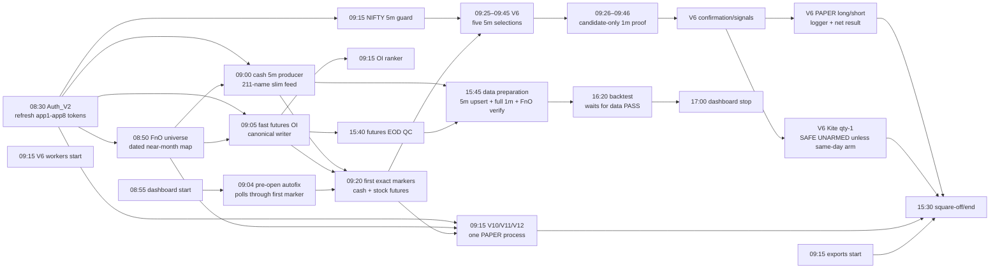
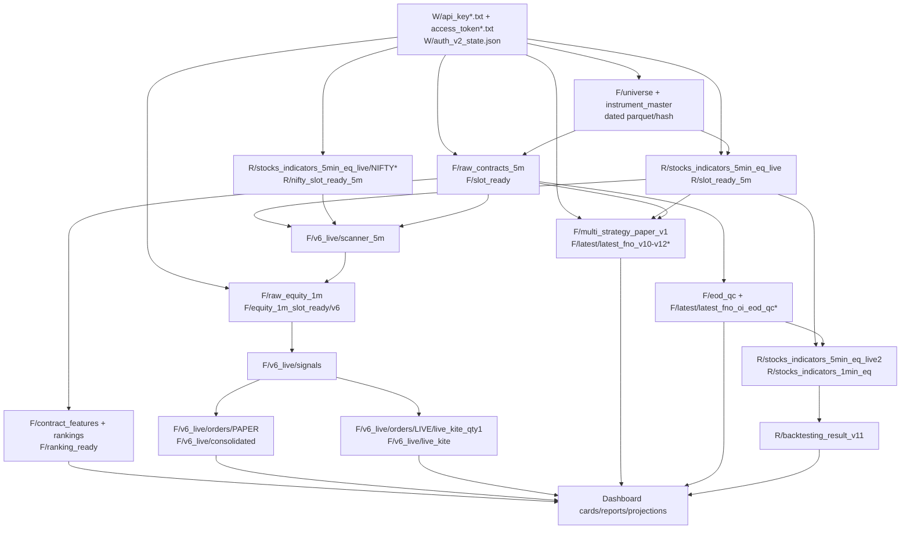

# EQIDV2 Dashboard Session Readiness Audit — 2026-09-02

Audit snapshot: 2026-09-01 evening, Asia/Kolkata. Dashboard: `http://127.0.0.1:8787/`.

## Executive verdict

The dashboard contains 83 visible cards, but they are not 83 independent jobs:

- 56 cards represent a real process or report-producing job.
- 26 cards are projections of CSV/report files owned by another process.
- 1 card (`v7_live_5min_monitor`) is a virtual dashboard aggregate.
- 29 cards are backed by enabled scheduled tasks, 53 are deliberately disabled, and 1 is virtual.
- Those 29 enabled cards reduce to 22 unique mapped tasks. Six additional operational companion tasks bring the September 2 due-task total to 28.

The enabled production/paper path is scheduled and materially hardened for September 2. It is not correct to promise that every visible strategy card will run: 53 cards are intentionally disabled, including real-money V7/V15/V16 executors and unapproved V8. Enabling them merely to make the dashboard green would create duplicate pipelines and real-order risk.

The September 2 fast futures-OI cutover is a GO. It preserves the canonical storage and marker contract and is expected to publish a full 210-stock marker in about 11–13 seconds under conditions comparable to the benchmark, versus 19.156 seconds for the clean legacy comparison. `NIFTYFPI26SEPFUT` can remain an explicitly recorded optional-index no-candle without blocking stock-strategy readiness.

The main quality risk tomorrow is the independent cash 5-minute feed. On September 1 its 09:45 marker missed MAZDOCK, which correctly blocked the fifth V6 selection/confirmation slot. Faster futures OI cannot repair an exchange/broker cash-candle miss, and the quality gate must not be weakened or synthetically filled.

## What was changed for September 2

1. Pre-open now selects exactly one required canonical OI producer by date:
   - September 2: fast production is required.
   - Other dates: the legacy producer remains required.
   - Shadow remains optional.
2. A never-run task or a same-day completed nonzero task result now fails readiness.
3. After 09:06, fast production must have current-session supervisor evidence.
4. The pre-open autofix loop remains in WAIT through 09:20, then requires the canonical 09:20 marker to be schema-valid, stock-complete, and published within 60 seconds.
5. Fast-producer autofix is scheduler-only. There is no detached BAT fallback and no possibility of an automatic second canonical writer.
6. The shared V10/V11/V12 task and the V6 quantity-one Kite task were added to conscious pre-open coverage.
7. V10/V11/V12 can no longer appear healthy from scheduler exit `0/NOT_RUN`; it needs current-session runtime status and at least seven healthy Kite apps.
8. V8 mutual-exclusion checks now include the V6 quantity-one Kite executor.
9. A V6 quantity-one Kite scheduler problem is manual-review only; pre-open will not create an extra live-executor start and never creates an arm file.
10. A normal NIFTY guard `STOPPED / hard_stop_reached` after market close is now dashboard-OK, while an unexplained STOPPED state remains a problem.
11. The dashboard Auth timeline was corrected from 09:00 to the real 08:30 trigger.
12. Scheduler settings were verified and hardened in place:
    - Fast production: `StartWhenAvailable=true`, `WakeToRun=true`, `IgnoreNew`.
    - V10/V11/V12 PAPER: exact 09:15 prospective start, `StartWhenAvailable=false`, `WakeToRun=true`, `IgnoreNew`, five one-minute retries.
    - Data for backtesting: `StartWhenAvailable=true`, `WakeToRun=true`, `IgnoreNew`.

No strategy formula, threshold, universe rule, signal schema, historical storage path, broker credential, disabled-task state, or live-arm file was changed.

## Timed operating flow

### Exact September 2 checkpoints

| Time IST | Required evidence | Healthy interpretation |
|---|---|---|
| 08:30–08:35 | `authentication_v2_runner.status` and `auth_v2_state.json` | Current-day tokens; all intended apps authenticated before consumers start. |
| 08:50 | `fno_oi/universe/near_month_2026-09-02.parquet` | Current date/hash, one near-month future per underlying. |
| 09:00 | Cash 5m supervisor/status | Running before the 09:20 completed candle. |
| 09:05–09:06 | Fast supervisor status/heartbeat | Same-day RUNNING/RESTARTING; legacy and shadow perform their intentional date-gate no-op. |
| 09:15–09:17 | V10/V11/V12 `status.json` | Same-day RUNNING, not `NOT_RUN`, with at least 7 healthy apps. |
| 09:20–09:21 | Canonical `slot_20260902_0920.json` | `stock_complete=true`, `stock_state=SUCCESS`, correct schema/date, publish delay no more than 60s. |
| 09:25, 09:30, 09:35, 09:40, 09:45 | Cash + futures exact-slot marker pair | Both complete for the frozen V6 stock universe. |
| 09:26, 09:31, 09:36, 09:41, 09:46 | Candidate-only 1m proof | Immutable scanner hash and exact completed 1m evidence. |
| By 09:50 | V6 scanner/feed/confirmation reports | Five processed slots, or a transparent fail-closed upstream reason. |
| 15:30–15:32 | PAPER/live state machines | Square-off/end state; quantity-one Kite remains unarmed unless explicitly armed by the operator. |
| 15:40 | FnO EOD QC | Inspect report contents; task exit 0 alone is not full-completeness proof. |
| 15:45 onward | Data-preparation log + same-day FnO verifier JSON | Child exits propagate; verifier scope is `fno` and overall status is PASS. |
| 16:20 onward | Backtest wait branch | Same-day run waits for producer END and FnO verifier PASS; it does not race the 15:45 producer. |

## Directory and read/write topology

Path shorthand: `W` is this workspace, `R` is `C:\TradingData\eqidv2`, and `F` is `R\fno_oi`.

### I/O contracts used by the card matrix

| Code | Exact inputs | Exact outputs and readers |
|---|---|---|
| `AUTH` | `W\api_key.txt`…`api_key8.txt`, login/TOTP material | `W\access_token*.txt`, request/refresh token files, `W\auth_v2_state.json`, runner status/log. Read by every Kite fetch, export, and broker executor. |
| `CASH5` | `AUTH`, `R\runtime_status\feed_universe_5m.json`, dated FnO mapping | `R\stocks_indicators_5min_eq_live\*_stocks_indicators_5min.parquet`, `R\slot_ready_5m\slot_YYYYMMDD_HHMM.json`; read by V6, V8, shared paper, and other cash strategies. |
| `NIFTY5` | `AUTH`, NIFTYBEES/NIFTY index mapping | NIFTY aliases in `R\stocks_indicators_5min_eq_live`, plus `R\nifty_slot_ready_5m`, fail/open markers; read as market-regime context. |
| `FNO-U` | `AUTH`, Kite NFO/NSE instruments | `F\instrument_master`, `F\universe\near_month_DATE.parquet`, `latest_near_month.parquet`, registry and summary; read by all FnO producers/strategies/QC and cash-manifest generation. |
| `FNO-OI` | `AUTH`, `FNO-U`, existing canonical histories | `F\raw_contracts_5m\<contract>_5minute.parquet`, `F\slot_ready\slot_*.json`, canonical/latest reports; read by ranker, V6, V8, V10–V12 and QC. Writes are normalized, merged/deduped and atomic; marker is last. |
| `FNO-RANK` | `FNO-U` + `FNO-OI` | `F\contract_features`, `F\feature_snapshots`, `F\rankings`, `F\ranking_ready`, leaderboard report. Dashboard/research reader; V6 does not consume it. |
| `V6-SCAN` | `FNO-U` + `CASH5` + `NIFTY5` + `FNO-OI`, frozen 53-session attestation | `F\v6_live\scanner_5m\DATE\slot_HHMM.json`, evidence/manifest/report; read by V6 candidate 1m and confirmation. |
| `V6-1M` | `V6-SCAN` candidate set + `AUTH` | `F\raw_equity_1m\DATE`, immutable `F\equity_1m_slot_ready\v6\DATE`; confirmation is the reader. |
| `V6-SIG` | `V6-SCAN` + `V6-1M` proof | `F\v6_live\confirmation_1m`, immutable `F\v6_live\signals\DATE\<signal_id>.json`; read by PAPER and quantity-one LIVE workers. |
| `V6-PAPER` | `V6-SIG`, quotes | `F\v6_live\orders\PAPER`, consolidated trade CSV, long/short/logger/net reports. Dashboard and backtest/research read them. |
| `V6-LIVE` | `V6-SIG`, `AUTH`, same-day `F\v6_live\live_arm.json`, kill-switch state | Isolated `F\v6_live\orders\LIVE\live_kite_qty1`, `F\v6_live\live_kite\signals_*`, `live_trades_*`, status/heartbeat. Missing arm means no broker orders. |
| `MULTI` | `AUTH`, `FNO-U`, `CASH5`, `FNO-OI`; independent exact 5×1 cash proof and S+1 union fetch | `F\multi_strategy_paper_v1\sessions\DATE`, evidence/checkpoint/events, isolated V10/V11/V12 ledgers and latest reports. Four cards read one process. |
| `EOD-QC` | `FNO-U` + canonical `FNO-OI` archive | `F\eod_qc` and `F\latest\latest_fno_oi_eod_qc.*`; operator/dashboard reader. No synthetic repair. |
| `FPA` | `CASH5` plus external forensic verdicts under `Short_term_trading\filtered_stocks_MIS_v2_data_nse` | `R\fundamental_price_action_v1`, FPA side CSVs and paper CSVs in `R\live_signals`; dashboard/paper reader. |
| `V7` | `CASH5`, accepted rules, final setup, then candidate exact 1m | `R\signal_discovery_v7_5mins_ID`, `R\entry_engine_1min_v5_ID`, V7 side/paper/live CSVs in `R\live_signals`. Live executor can place real MIS orders. |
| `BT` | Live 5m archive, full 1m archive, FnO universe/verifier, strategy/paper evidence | `R\stocks_indicators_5min_eq_live2`, `R\stocks_indicators_1min_eq`, `R\backtesting_result_v11`; dashboard/research reader. |
| `RESEARCH` | V7 candidates/audits/signals/paper, historical bars and prior backtests | `R\live_research_v7_research_layer`, qualification/gate/causality/full-pipeline/shadow/lab roots. Human-gated; no scheduled live-rule promotion. |
| `V16` | `CASH5`, `NIFTY5`, pending pool and exact pending-only refresh | `R\slot_ready_5m_pending`, V16 pending/detected/signal/paper/live files in `R\live_signals`; live executor can place real MIS orders. |
| `V15` | 15m/5m context and legacy V15 signals | V15 side/paper/live files in `R\live_signals`; live executor can place real MIS orders. |
| `EXPORT` | Primary Kite account through `AUTH` | `W\kite_exports\holdings_YYYYMMDD.csv`, `positions_day_YYYYMMDD.csv`, aliases/meta; dashboard projections. |
| `CONTROL` | Task Scheduler, local dashboard HTTP, selected statuses/logs | Pre-open latest/date reports in `W\logs`, dashboard virtual/aggregate content; operator reader. |

## Complete 83-card audit

Legend: `READY` means configured for its intended September 2 role; `CONDITIONAL` means a strict upstream gate can correctly block it; `OBSERVE` is a first prospective validation; `EXPECTED NO-OP` and `EXPECTED_DISABLED` are intentional; `SAFE UNARMED` means the live process may run but cannot place orders without a separate same-day arm.

### Live Market Data

| # | Dashboard card | Kind | Task / actual start | Contract | September 2 verdict |
|---:|---|---|---|---|---|
| 1 | `nifty_guard_fetch_v16_5min` | Process | `EQIDV2_nifty_guard_fetch_v16_5min_0915` / 09:15 | `NIFTY5` | READY. Sep-1 produced 75 ready markers and stopped normally at 15:31; normal cutoff STOPPED is no longer shown as a problem. |
| 2 | `eod_5min_data` | Process | `EQIDV2_eod_5mins_data_0900` / 09:00 | `CASH5` | READY but highest data-quality risk. Sep-1 09:45 missed MAZDOCK and correctly blocked V6 slot five. |
| 3 | `kiteticker_5min_data` | Process, isolated shadow | Disabled / 09:00 definition | isolated KiteTicker root | EXPECTED_DISABLED. No production consumer reads its isolated store. |
| 4 | `eod_1min_data` | Process, broad historical updater | Disabled / 09:15 definition | broad 1m archive | EXPECTED_DISABLED. V6 uses its candidate-only `V6-1M` producer instead. |

### FnO and paper/live branches

| # | Dashboard card | Kind | Task / actual start | Contract | September 2 verdict |
|---:|---|---|---|---|---|
| 5 | `fno_oi_universe` | Process | `EQIDV2_fno_oi_universe_0850` / 08:50 | `FNO-U` | READY; dated hash/universe is the authority. |
| 6 | `fno_oi_fetch_5min_fast_production` | Process, canonical writer | one-time task / 09:05 | `FNO-OI` | GO. Required producer on Sep-2; same storage/schema, stock marker quality locked. |
| 7 | `fno_oi_fetch_5min` | Process, legacy canonical writer | weekday task / 09:05 | `FNO-OI` | EXPECTED NO-OP on Sep-2 only; resumes Sep-3. Task result 0 is not production evidence. |
| 8 | `fno_oi_fetch_5min_fast_shadow` | Process, isolated validator | weekday task / 09:06 | isolated shadow archive | EXPECTED NO-OP on Sep-2 only. No same-day independent shadow comparison. |
| 9 | `fno_oi_feature_ranker` | Process | task / 09:15 | `FNO-RANK` | READY and path-compatible. Sep-1 completed 75/75. |
| 10 | `fno_v6_scanner_5min` | Process | task-name suffix 09:18; actual 09:15 | `V6-SCAN` | CONDITIONAL on five complete cash+OI marker pairs. Frozen attestation passes. |
| 11 | `fno_v6_equity_1min_feed` | Process | suffix 09:19; actual 09:15 | `V6-1M` | CONDITIONAL on scanner snapshots; strict exact 1m proof. |
| 12 | `fno_v6_confirmation_1min` | Process | suffix 09:19; actual 09:15 | `V6-SIG` | CONDITIONAL; no broker fallback and no synthetic candle. |
| 13 | `fno_v6_live_long` | PAPER process despite “live” name | suffix 09:20; actual 09:15 | `V6-PAPER` | READY/CONDITIONAL. Does not place broker orders. |
| 14 | `fno_v6_live_short` | PAPER process despite “live” name | suffix 09:20; actual 09:15 | `V6-PAPER` | READY/CONDITIONAL. Does not place broker orders. |
| 15 | `fno_v6_trade_logger` | Process | suffix 09:20; actual 09:15 | `V6-PAPER` | READY; consolidates authoritative order states. |
| 16 | `fno_v6_net_result` | Process | suffix 09:20; actual 09:15 | `V6-PAPER` | READY; result can still carry an upstream-blocked notice. |
| 17 | `live_signals_csv_fno_id_v6_short` | Projection | quantity-one Kite owner / 09:15 | `V6-LIVE` | SAFE UNARMED projection; may legitimately be empty. |
| 18 | `live_signals_csv_fno_id_v6_long` | Projection | same owner | `V6-LIVE` | SAFE UNARMED projection; may legitimately be empty. |
| 19 | `live_kite_trades_csv_fno_id_v6` | Projection | same owner | `V6-LIVE` | SAFE UNARMED projection; zero fills are expected without arm. |
| 20 | `kite_trade_fno_id_v6` | Real broker process, qty 1 | `EQIDV2_fno_v6_live_kite_qty1_0915` / 09:15 | `V6-LIVE` | SAFE UNARMED. `live_arm.json` is absent; no arm will be created automatically. |
| 21 | `fno_v8_combined_paper` | Process, PAPER-only | Disabled / 09:15 definition | independent V8 root | EXPECTED_DISABLED and unapproved; do not enable as a dashboard repair. |
| 22 | `fno_v10_v11_v12_paper` | One PAPER process | task / exact 09:15 | `MULTI` | OBSERVE. First clean full prospective day; must have 7+ healthy apps and current RUNNING status. |
| 23 | `fno_v10_paper` | Projection of #22 | same task | `MULTI` V10 ledger | OBSERVE; not an independent session. |
| 24 | `fno_v11_paper` | Projection of #22 | same task | `MULTI` V11 ledger | OBSERVE; not an independent session. |
| 25 | `fno_v12_paper` | Projection of #22 | same task | `MULTI` V12 ledger | OBSERVE; not an independent session. |
| 26 | `fno_oi_eod_qc` | Process | task / 15:40 | `EOD-QC` | READY, but inspect PARTIAL details; exit 0 alone is insufficient. |
| 83 | `v7_live_5min_monitor` | Virtual aggregate | no task | `CONTROL` + all FnO contracts | READY as UI synthesis. It must judge fast heartbeat/marker, not old/shadow no-op result 0. |

### Forensic / Fundamental Price Action

| # | Dashboard card | Kind | Task / definition | Contract | September 2 verdict |
|---:|---|---|---|---|---|
| 27 | `fundamental_price_action_v1` | Process | Disabled / 09:15 | `FPA` | EXPECTED_DISABLED; last evidence Aug-31. |
| 28 | `live_signals_csv_fpa_v1_short` | Projection of #27 | same task | `FPA` | EXPECTED_DISABLED/absent. |
| 29 | `live_signals_csv_fpa_v1_long` | Projection of #27 | same task | `FPA` | EXPECTED_DISABLED/absent. |
| 30 | `live_papertrade_result_csv_fpa_v1` | Projection | disabled paper owner / 09:20 | `FPA` | EXPECTED_DISABLED/absent. |
| 31 | `paper_trade_fpa_v1` | PAPER process | Disabled / 09:20 | `FPA` | EXPECTED_DISABLED. |
| 32 | `collect_filtered_stock_data` | External-data refresh process | Disabled / 09:30 | `FPA` external source | EXPECTED_DISABLED; external directory is an additional feasibility dependency if FPA is restored. |

### Core V7 and retired legacy V7

| # | Dashboard card | Kind | Task / actual start | Contract | September 2 verdict |
|---:|---|---|---|---|---|
| 33 | `live_combined_csv_id_5min_v7_persistent` | Retired shadow process | Disabled / 09:09 | legacy V7 isolated root | EXPECTED_DISABLED. It cannot own official V7 signal CSVs. |
| 34 | `signal_discovery_v7_5min_id` | Process | Disabled / actual 09:00 | `V7` | EXPECTED_DISABLED. |
| 35 | `candidate_tickers_v7_5min_id` | Projection of #34 | same task | `V7` | EXPECTED_DISABLED. |
| 36 | `entry_engine_1min_v5_id` | Process | Disabled / actual 09:00 | `V7` | EXPECTED_DISABLED. |
| 37 | `live_signals_csv_id_5min_v7_short` | Projection of #36 | same task | `V7` | EXPECTED_DISABLED/absent. |
| 38 | `live_signals_csv_id_5min_v7_long` | Projection of #36 | same task | `V7` | EXPECTED_DISABLED/absent. |
| 39 | `live_papertrade_result_csv_id_5min_v7` | Projection | disabled PAPER owner / 09:00 | `V7` | EXPECTED_DISABLED/absent. |
| 40 | `paper_trade_id_5min_v7` | PAPER process | Disabled / 09:00 | `V7` | EXPECTED_DISABLED. |
| 41 | `live_kite_trades_csv_id_5min_v7` | Projection | disabled LIVE owner / 09:00 | `V7` | EXPECTED_DISABLED/absent. |
| 42 | `kite_trade_id_5min_v7` | Real broker process | Disabled / 09:00 | `V7` | EXPECTED_DISABLED. DO NOT ENABLE without an explicit real-money go/no-go. |

### Data and backtesting

| # | Dashboard card | Kind | Task / actual start | Contract | September 2 verdict |
|---:|---|---|---|---|---|
| 43 | `data_for_backtesting` | Process | enabled / 15:45 | `BT` producer | READY. Current wrapper uses `--scope fno`, propagates child/verifier nonzero, and is wake/catch-up hardened. |
| 44 | `backtesting_result_v11` | Process | enabled / 16:20 | `BT` consumer | READY. Same-day branch waits up to 5400s for producer END + FnO PASS. It may start after 16:20 because 15:45 work took about 36m on Sep-1. |

### Research and suggestions

All twelve are non-ordering research/report jobs. Their disabled state is intentional and their historical reports must not be read as September 2 activity.

| # | Dashboard card | Kind | Task / definition | Contract | September 2 verdict |
|---:|---|---|---|---|---|
| 45 | `v7_gate_promotion` | Dry-run promotion report by default | Disabled / 16:25 | `RESEARCH` | EXPECTED_DISABLED; explicit manual `--apply` is the only live-rule mutation path. |
| 46 | `v7_qualification` | Report | Disabled / 16:30 | `RESEARCH` | EXPECTED_DISABLED. |
| 47 | `v7_research_layer` | Aggregate report process, two tasks | Disabled / 09:17 + 16:15 | `RESEARCH` | EXPECTED_DISABLED. |
| 48 | `daily_live_v7_research_session` | Report process | Disabled / 09:17 | `RESEARCH` | EXPECTED_DISABLED. |
| 49 | `v7_nse_id_cost` | EOD attribution | Disabled / 16:05 | `RESEARCH` | EXPECTED_DISABLED. |
| 50 | `v7_walkforward_gate` | Walk-forward report | Disabled / 16:20 | `RESEARCH` | EXPECTED_DISABLED; latest history was insufficient. |
| 51 | `v7_causality_audit` | Audit report | Disabled / 16:05 | `RESEARCH` | EXPECTED_DISABLED. |
| 52 | `v7_pre_momentum_filter_analyst` | Shadow analyst | Disabled / 09:17 | `RESEARCH` | EXPECTED_DISABLED; advisory only. |
| 53 | `v7_full_pipeline_entry_research` | Research process | Disabled / 16:20 | `RESEARCH` | EXPECTED_DISABLED. |
| 54 | `v7_full_pipeline_entry_research_v2` | Research process | Disabled / 16:30 | `RESEARCH` | EXPECTED_DISABLED. |
| 55 | `v7_shadow_candidate_monitor` | Shadow registry monitor | Disabled / 16:45 | `RESEARCH` | EXPECTED_DISABLED; never writes live accepted rules. |
| 56 | `v11_lab_shadow_monitor` | Lab report | Disabled / 16:55 | `RESEARCH` | EXPECTED_DISABLED; latest historical run failed Aug-12 and needs separate repair before reactivation. |

### V16 / parallel strategy

The entire V16 chain is disabled. Its live executor is real-money. Simultaneous 09:00 trigger definitions do not express the dependency order; runtime markers are the safety mechanism if this chain is ever deliberately restored.

| # | Dashboard card | Kind | Task / definition | Contract | September 2 verdict |
|---:|---|---|---|---|---|
| 57 | `signal_early_engine_v16_5min` | Candidate process | Disabled / 09:00 | `V16` | EXPECTED_DISABLED. |
| 58 | `pending_signals_v16_5min` | Projection of #57 | same task | `V16` | EXPECTED_DISABLED. |
| 59 | `pending_data_fetcher_v16_5min` | Pending-only fetch process | Disabled / 09:00 | `V16` | EXPECTED_DISABLED. |
| 60 | `detection_engine_v16_5min` | Confirmation process | Disabled / 09:00 | `V16` | EXPECTED_DISABLED. |
| 61 | `detected_signals_v16_5min` | Projection of #60 | same task | `V16` | EXPECTED_DISABLED. |
| 62 | `live_signals_csv_v16_5min_short` | Projection of #60 | same task | `V16` | EXPECTED_DISABLED. |
| 63 | `live_signals_csv_v16_5min_long` | Projection of #60 | same task | `V16` | EXPECTED_DISABLED. |
| 64 | `live_kite_trades_csv_v16_5min` | Projection | disabled LIVE owner / 09:00 | `V16` | EXPECTED_DISABLED. |
| 65 | `kite_trade_v16_5min` | Real broker process | Disabled / 09:00 | `V16` | EXPECTED_DISABLED. DO NOT ENABLE as a dashboard repair. |
| 66 | `paper_trade_v16_5min` | PAPER process | Disabled / 09:00 | `V16` | EXPECTED_DISABLED. |
| 67 | `live_papertrade_result_csv_v16_5min` | Projection of #66 | same task | `V16` | EXPECTED_DISABLED. |
| 68 | `live_combined_csv_v16_5min` | Shadow/audit scanner | Disabled / 09:00 | isolated V16 shadow signals | EXPECTED_DISABLED; its label can be mistaken for production. |

### Legacy V15, admin and exports

| # | Dashboard card | Kind | Task / actual start | Contract | September 2 verdict |
|---:|---|---|---|---|---|
| 69 | `eod_15min_data` | Process | Disabled / 09:00 | broad 15m archive | EXPECTED_DISABLED; no currently enabled strategy requires it. |
| 70 | `nifty_guard_fetch_v15` | Legacy NIFTY process | Disabled / 09:15 | `V15` | EXPECTED_DISABLED. |
| 71 | `live_combined_csv_v15_new_persistent` | Legacy scanner | Disabled / 09:00 | `V15` | EXPECTED_DISABLED. |
| 72 | `live_signals_csv_v15_new_short` | Projection of #71 | same task | `V15` | EXPECTED_DISABLED. |
| 73 | `live_signals_csv_v15_new_long` | Projection of #71 | same task | `V15` | EXPECTED_DISABLED. |
| 74 | `live_kite_trades_csv_v15` | Projection | disabled LIVE owner / 09:05 | `V15` | EXPECTED_DISABLED. |
| 75 | `kite_trade_v15` | Real broker process | Disabled / 09:05 | `V15` | EXPECTED_DISABLED. DO NOT ENABLE without explicit approval. |
| 76 | `paper_trade_v15` | PAPER process | Disabled / 09:00 | `V15` | EXPECTED_DISABLED. |
| 77 | `live_papertrade_result_csv_v15` | Projection of #76 | same task | `V15` | EXPECTED_DISABLED. |
| 78 | `kite_positions_day_today_csv` | Projection | export owner / 09:15 | `EXPORT` | READY if Auth succeeds; Sep-1 legitimately had zero day positions. |
| 79 | `kite_holdings_today_csv` | Projection | export owner / 09:15 | `EXPORT` | READY if Auth succeeds; Sep-1 exported 42 holdings. |
| 80 | `preopen_healthcheck` | Control process/report | enabled / 09:05 plus autofix 09:04 | `CONTROL` | READY. Shows WAIT until first fast marker, then PASS/FAIL from real evidence. |
| 81 | `authentication_v2` | Process | enabled / actual 08:30 | `AUTH` | CRITICAL READY prerequisite. Must refresh the September 2 sessions. |
| 82 | `eod_1540_update` | Legacy EOD flush | Disabled / 15:40 | legacy 5m/15m stores | EXPECTED_DISABLED; enabling it could overlap EOD QC/data preparation. |

## Worked examples

### Normal 09:25 V6 path

1. Cash producer closes the 09:20–09:25 candle and publishes `R\slot_ready_5m\slot_20260902_0925.json` only after exact cash rows are accounted for.
2. Fast OI writes/atomically replaces each canonical futures parquet, drains all writers, and then publishes `F\slot_ready\slot_20260902_0925.json`.
3. V6 scanner verifies both markers, hashes and stock completeness, evaluates the frozen 210-stock mapping, and writes `F\v6_live\scanner_5m\2026-09-02\slot_0925.json`.
4. The candidate-only 1m producer fetches the completed 09:26 evidence only for the scanner candidate set and seals it with the scanner hash.
5. Confirmation consumes that immutable proof and emits zero or more signed V6 signals.
6. PAPER long/short workers can act on those signals. The quantity-one Kite worker can act only if its separate same-day arm exists and the kill switch is clear.

Expected futures timing is approximately 09:25:11–09:25:13 under benchmark-like conditions. The first-slot readiness limit is 60 seconds to retain headroom without lowering completeness.

### Optional `NIFTYFPI26SEPFUT` no-candle

If all 210 mapped stock futures are complete but `NIFTYFPI26SEPFUT` has no exact-slot candle:

- The producer records the index symbol and no-candle state.
- `stock_complete=true` and `stock_state=SUCCESS` can still be published.
- `global_complete` can be false, preserving the audit truth.
- Stock strategies proceed without a fabricated or forward-filled index candle.
- EOD QC continues to display the index gap.

This is the intended quality-preserving behavior. The index is not silently removed from the audit; it is excluded only from the stock-strategy readiness denominator and retry tail.

### Sep-1 09:45 cash miss

Futures eventually became stock-complete, but the cash marker was 210/211 overall and 209/210 for mapped FnO stocks because MAZDOCK lacked the exact candle. V6 processed four of five slots and returned `BLOCKED / INCOMPLETE_BY_DEADLINE` at 09:50. That result was correct. The remediation is better availability/observation of the cash producer, not weakening the marker or filling a fake candle.

## Remaining hurdles and operating advice

| Severity | Hurdle | Consequence | Required handling |
|---|---|---|---|
| Critical | All due tasks use `Saarit / Interactive` logon. | A logged-out session can prevent the unattended chain even when WakeToRun is true. | Keep the user session logged in and the workstation powered. |
| High | Cash 5m exact-candle availability. | One stock miss can block a V6 slot. | Watch cash marker completeness and duration at each 09:25–09:45 slot; preserve fail-closed quality. |
| High | Fast trial has no automatic legacy takeover on Sep-2. | Repeated fast failure leaves no canonical producer. | Fallback must be deliberate: stop fast, confirm exclusivity, then manually bypass the legacy date gate. Never run both. |
| High | V10/V11/V12 starts with only the minimum seven healthy apps if one app fails. | Another app loss blocks/degrades the shared exact-data source. | Confirm current-day auth and shared status/app count by 09:17; treat this as an observation day. |
| High | Quantity-one Kite task is a real-order executor. | Creating an arm could place MIS orders. | Leave unarmed unless the operator separately approves and creates a valid same-day arm. Pre-open never arms it. |
| Medium | Old and shadow tasks return 0 on their Sep-2 date-gate no-op. | Scheduler-only monitoring can falsely call them productive. | Use the fast supervisor and canonical marker as production evidence. |
| Medium | FnO EOD QC returns 0 even when its report is PARTIAL. | Scheduler result can overstate archive completeness. | Inspect `latest_fno_oi_eod_qc.md` counts/symbols. |
| Medium | Dashboard/public-link task is long-running and may show lifecycle result noise. | Last Result alone may look bad after the stop job kills it. | Use HTTP reachability and current dashboard process/status. |
| Medium | NTP pool reachability was intermittent, although HTTPS clock comparison was close. | Large future drift could affect exact-slot timing. | Check the workstation clock before open if timestamps look abnormal. |
| Low | Several log cards point to historical/undated logs while runtime status is current. | A stale fatal line can be mistaken for today’s failure. | Prefer same-session status/report timestamps and scheduler overlay. |

## Verification completed

- Focused readiness/dashboard/FnO/V8/multi-paper suite: 83 tests plus 4 subtests passed, then the refined pre-open suite: 73 tests plus 4 subtests passed.
- Fast-producer focused acceptance: 18/18 passed, including exact window, canonical storage, atomic failure handling, alternate-app retry, marker-after-write, and optional-index behavior.
- Frozen V6 attestation checks: 4/4 passed. The `expected 53, observed 54` line is stale Aug-13 evidence, not a current blocker.
- Complete operational `tests/` suite, excluding the separately locked research-package file: **1,415 tests plus 224 subtests passed**.
- Locked V10 full-history research-package file: **8 passed, 1 failed closed** because its frozen launcher SHA-256 (`7b5e...`) does not match the current launcher (`1563...`). This disabled research package is not in the September 2 live/PAPER path; the lock was deliberately not rewritten without a provenance re-freeze.
- Scheduler re-query confirms the three hardened task definitions, exact actions, next runs, `IgnoreNew`, and wake/catch-up policies.
- Canonical runtime directories, logs, credentials/token files, Python, network reachability and disk capacity were present at audit time.
- The dashboard server was restarted with the corrected classifier and rechecked at 18:49 IST: `FnO Futures OI Fetch (Fast Production)` is present at 09:05, the complete `All 83` view is restored, and the dashboard reports **0 hard failures**. Post-close `WATCH` states remain visible as evidence for the next-session runbook.

## External operating references

- September 2, 2026 is an NSE trading day; the September F&O holiday listed by NSE is September 14: <https://nsearchives.nseindia.com/content/circulars/FAOP71777.pdf>
- Kite’s documented historical-candle rate limit is 3 requests/second: <https://kite.trade/docs/connect/v3/exceptions/>

## Bottom line for tomorrow

Expected to run: Auth, universe, cash 5m, NIFTY guard, fast canonical OI, ranker, V6 PAPER chain, shared V10/V11/V12 PAPER, quantity-one Kite coordinator in SAFE UNARMED mode, exports, EOD QC, data preparation and backtest.

Expected not to run: old OI and shadow only on September 2; V8; FPA; Core V7; all V7 research; V16; legacy V15; broad 1m/15m and legacy 15:40 flush. Their disabled/no-output cards are intentional and should not be “fixed” by enabling them.
