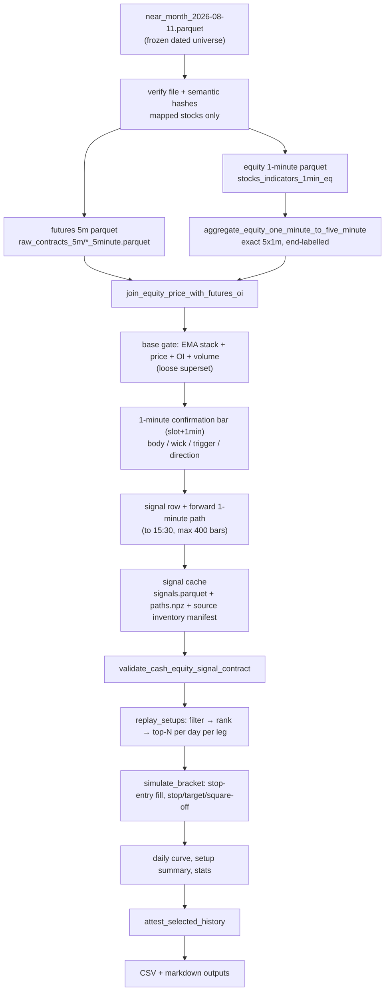
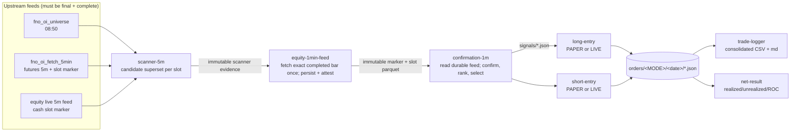
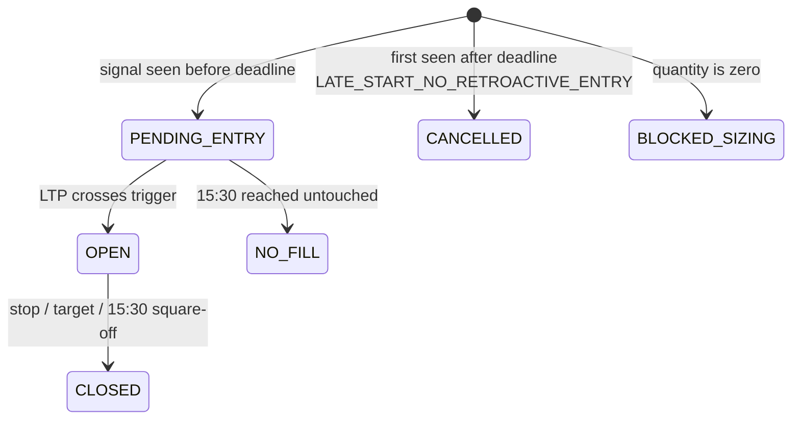

# FnO V6 — Strategy, Backtest Flow and Live Flow

Reference document for the **FnO EMA/OI opening-window strategy**: the frozen V6
setup book, the backtest that produced and attests it, the dedicated durable
1-minute feed producer, and the six-role live/paper runtime that trades it.

- Live entry point: [fno_v6_live.py](fno_v6_live.py) → shared runtime [fno_v5_live.py](fno_v5_live.py)
- Live config: [fno_v6_live_config.py](fno_v6_live_config.py)
- Durable confirmation feed: [fno_equity_fetch_1min.py](fno_equity_fetch_1min.py)
- Completeness/deadline replay: [fno_v6_parity_replay.py](fno_v6_parity_replay.py)
- Backtest / frozen book: [fno_oi_ema_confirm_0925_0930_0935_0940_0945_v6.py](fno_oi_ema_confirm_0925_0930_0935_0940_0945_v6.py)
- Data contract: [fno_oi_hybrid_data.py](fno_oi_hybrid_data.py) — `fno_v5_equity_real_5m_futures_oi_v4`
- Strategy version string: `FNO_V6_BEST_NET_CASH_EQUITY_20260811`, objective `BEST_NET`

---

## 1. One-paragraph summary

In the first 30 minutes of the session the strategy looks for **F&O stocks whose
cash price is trending (EMA9/20/50 stacked), moving hard on a 5-minute bar, on
expanding volume, while open interest in the mapped near-month future is rising**
— i.e. a fresh directional move backed by new positions, not short covering.
The 5-minute bar raises a *candidate*; the very next 1-minute candle must close
in the same direction to *confirm*. Entry is a **stop order at that confirmation
candle's extreme**, so price must continue through the confirmation high (LONG)
or low (SHORT) before any risk is taken. Each entry gets a fixed
percentage stop and target and is squared off at 15:30 regardless. Only five
scan slots are traded (09:25, 09:30, 09:35, 09:40, 09:45), at most one LONG and
one or two SHORT names per slot, at Rs 10,000 capital × 5x = Rs 50,000 exposure
per entry.

**Everything priced or executed is NSE cash equity. The future contributes three
fields only: `oi`, `prev_oi`, `oi_change_pct`.** That separation is enforced by
contract validators on both the backtest and the live path.

---

## 2. Instrument and data contract

| Concern | Source | Notes |
|---|---|---|
| Price, volume, OHLC, EMA9/20/50, `traded_value` | **NSE cash equity** | 5-minute bars, end-labelled |
| Confirmation candle, trigger, entry, exits, LTP | **NSE cash equity** | 1-minute bars / quotes |
| `oi`, `prev_oi`, `oi_change_pct` | **NFO near-month future** | joined on exact bar-end timestamp |
| Universe | Live: `latest_near_month.parquet`; promoted V6 backtest: dated `near_month_2026-08-11.parquet` | the live universe may roll; the promoted replay refuses the mutable alias and verifies the dated file plus full/mapped semantic hashes |

Mapping future → equity is done by `hybrid.ensure_equity_mapping()`. Any stock
future that cannot be mapped to a cash symbol is a **hard failure** (the scanner
raises); only index futures may be dropped. `LTM` → `LTIM` is the one alias.

Bar quality rules (`completed_real_equity_five_minute_bars`) — a 5-minute equity
bar is usable only if it is:

- not the 09:15 opening snapshot,
- not `gap_filled`, `opening_snapshot` or `provisional_stale`,
- built from exactly 5 one-minute rows when `source_1m_count` is present,
- not an exact OHLCV copy of the adjacent prior bar (unless both are proven 5×1m).

OI is admitted only when both `oi` and `prev_oi` are positive and finite;
otherwise `oi_change_pct` is NaN and the row cannot signal.

> **Known limitation** (carried in the report header): the historical OI cache
> uses 26AUG futures OI across the whole backtest period. It is not a rolling
> near-month OI series.

---

## 3. Strategy specification

### 3.1 Scan slots

Five 5-minute signal bars, each with a fixed 1-minute confirmation bar:

```
09:25 → 09:26    09:30 → 09:31    09:35 → 09:36    09:40 → 09:41    09:45 → 09:46
```

Timestamps are **candle-end labelled**. The 09:25 signal bar covers 09:20–09:25;
its confirmation candle covers 09:25–09:26. (09:20 is never a signal bar — it has
no 5-minute predecessor to diff against.)

### 3.2 Base candidate gate (the loose superset)

Applied per contract on the signal bar. Identical in backtest
(`fno_oi_ema_confirm_sweep.build_signal_table`) and live
(`fno_v5_live._base_signal_side`):

```
LONG   : ema9 > ema20 > ema50  AND  price_change_pct >= +0.10
SHORT  : ema9 < ema20 < ema50  AND  price_change_pct <= -0.10
BOTH   : oi > prev_oi  AND  oi_change_pct >= 0.05  AND  volume_ratio >= 0.80
```

- `price_change_pct` = close vs previous 5-minute close, in %.
- `volume_ratio` = bar volume ÷ 20-bar prior-volume mean (min 5 periods, shifted — no look-ahead).
- `traded_value` = close × volume.

Any row with a NaN in the required columns is rejected. This superset is
deliberately loose: every tradable setup is a subset of it, so signals are
computed once and reused across the whole parameter search.

### 3.3 Confirmation gate (1-minute)

On the candle ending at `confirmation_end`:

```
range   = high - low                     (must be > 0)
body_ratio = |close - open| / range
wick_ratio = (upper wick if LONG else lower wick) / range
trigger    = high if LONG else low

LONG  confirmed  ⟺  close > open  AND  close > signal-bar close
SHORT confirmed  ⟺  close < open  AND  close < signal-bar close
```

A candidate that fails direction is dropped (`direction_rejected`); it never
reaches setup filtering.

### 3.4 The V6 setup book (frozen, 10 legs)

`ACTIVE_SETUPS` in [fno_oi_ema_confirm_0925_0930_0935_0940_0945_v6.py](fno_oi_ema_confirm_0925_0930_0935_0940_0945_v6.py#L94-L105).
All legs are `FILTERED` mode with `min_traded_value = 0`.

| Signal | Confirm | Side | Max | Picker | Price % | OI % | Vol ratio | Body ≥ | Wick ≤ | Stop % | Target % |
|---|---|---|---:|---|---:|---:|---:|---:|---:|---:|---:|
| 09:25 | 09:26 | LONG | 1 | max_liquidity | 0.30 | 0.10 | 3.0 | 0.6 | 0.5 | 0.50 | 3.00 |
| 09:25 | 09:26 | SHORT | 2 | max_volume | 0.20 | 0.10 | 1.5 | 0.4 | 0.5 | 0.75 | 3.00 |
| 09:30 | 09:31 | LONG | 1 | max_move | 0.65 | 0.10 | 1.0 | 0.5 | 0.5 | 1.00 | 2.50 |
| 09:30 | 09:31 | SHORT | 1 | max_move | 0.20 | 0.25 | 1.0 | 0.4 | 0.5 | 1.00 | 3.00 |
| 09:35 | 09:36 | LONG | 1 | max_liquidity | 0.20 | 0.10 | 1.0 | 0.6 | 0.5 | 1.00 | 2.50 |
| 09:35 | 09:36 | SHORT | 2 | max_liquidity | 0.50 | 1.00 | 1.0 | 0.4 | 0.5 | 1.00 | 3.00 |
| 09:40 | 09:41 | LONG | 1 | max_liquidity | 0.20 | 0.10 | 2.0 | 0.5 | 0.5 | 0.50 | 2.50 |
| 09:40 | 09:41 | SHORT | 1 | max_move | 0.20 | 0.10 | 1.0 | 0.4 | 0.5 | 1.00 | 3.00 |
| 09:45 | 09:46 | LONG | 1 | max_move | 0.65 | 0.10 | 1.0 | 0.4 | 0.5 | 1.00 | 3.00 |
| 09:45 | 09:46 | SHORT | 1 | max_volume | 0.20 | 0.75 | 1.0 | 0.4 | 0.3 | 1.00 | 2.00 |

Structural invariants enforced at import time by `validate_configuration()` /
`validate_strategy()`: exactly 10 legs, one leg per (slot, side), confirmation
times must match the canonical map, **LONG cap 1 / SHORT cap 2**. Violations
raise before anything runs. Ceiling: **5 LONG + 7 SHORT = 12 orders per day**.

For a LONG leg the price filter is `price_change_pct >= +X`; for a SHORT leg it
is `price_change_pct <= -X` (the table stores the magnitude).

### 3.5 Ranking and selection

Per (slot, side), among confirmed candidates that pass the leg's filters:

```
sort by  picker value        DESC
then     traded_value        DESC      (liquidity tie-break)
then     tradingsymbol       ASC       (deterministic)
take     top `max_entries`
```

Pickers: `max_oi` (oi_change_pct), `max_volume` (volume_ratio), `max_move`
(|price_change_pct|), `max_body` (body_ratio), `max_liquidity` (traded_value).

Backtest (`select_setup_rows`) and live (`config.rank_candidates`) implement the
same ordering — the backtest groups per day, the live path is already inside one
session.

### 3.6 Entry, exits, sizing, cost

| Item | Rule |
|---|---|
| Entry order | **Stop-market** at the confirmation candle extreme (`trigger`), rounded to tick |
| Stop | `entry × (1 ∓ stop_pct/100)`, tick-rounded |
| Target | `entry × (1 ± target_pct/100)`, tick-rounded |
| Time exit | Square-off at **15:30** |
| Tie-break | If stop and target are reachable in the same bar, **stop wins** (pessimistic) |
| Capital | Rs 10,000 per entry |
| Leverage | 5x → **Rs 50,000 target exposure** per entry |
| Quantity | `floor(50,000 / entry_price)`; LIVE additionally floors to a lot multiple |
| Cost | **5 bps round-trip**, charged on entry notional |
| Product | MIS (intraday) |

Capital and leverage are **hard-locked**: passing any other `--capital` /
`--leverage` to the live runtime raises immediately.

---

## 4. Backtest flow (V6)

### 4.1 Pipeline



### 4.2 Signal cache

`fno_oi_ema_confirm_optimize.load_signals()` owns a cache at
`<FNO_ROOT>/strategy_research/_signal_cache_equity_1m_aggregated_5m_futures_oi_v4/`
(`signals.parquet`, `paths.npz`, `manifest.json`). The manifest pins one dated
universe and inventories every mapped futures-5m and equity-1m source file with
size, mtime and SHA-256. Its canonical source digest, construction settings,
`square_off`, and `max_forward_bars` form the cache key. The two cache artifacts
also carry verified SHA-256 hashes. Any source-byte, universe, contract, or
artifact drift forces a rebuild or fails closed; a mutable `latest_*` alias is
never admitted by the promoted V6 replay.

Hashing is incremental: an unchanged path/size/mtime reuses its prior digest;
a changed file is streamed once and checked for a stat race before and after
the read. A promoted run refuses missing sources and incomplete persisted
equity/futures mappings instead of silently dropping a symbol.

Backtest 5-minute equity bars are *constructed*, not read from the 5-minute
store: `NSE_EQUITY_1M_CAUSAL_5X_AGGREGATION` groups exactly five real 1-minute
rows (offsets 1..375 from 09:15) into an end-labelled 5-minute candle, and drops
any group that isn't exactly 5 rows spanning `slot_end-4min … slot_end`.

Each signal also stores its **forward 1-minute path** (`high`, `low`, `close`
arrays) starting from the bar *after* the confirmation bar, truncated at
square-off — so a 09:25 signal confirms on the 09:26 candle and can first fill
on the candle ending 09:27. **No same-bar fill.**

### 4.3 Fill and exit simulation (`simulate_bracket`)

```
1. Walk the forward path; the first bar whose high >= trigger (LONG)
   or low <= trigger (SHORT) is the entry bar. No touch ⇒ NaN ⇒ NO_FILL.
2. From that bar onward, find the first stop hit and first target hit.
3. Neither hit  ⇒ exit at the last close (square-off).
   Stop index <= target index ⇒ exit at stop (ties resolve to the stop).
   Otherwise ⇒ exit at target.
4. net_return_pct = (gross_return - 5bps) × 100
```

Note the simulator computes stop/target from the **trigger** price (the intended
stop level), while live recomputes them from the **actual fill price**. See §6.

### 4.4 Aggregation and metrics

- **Trade PF** = Σ positive trade returns ÷ |Σ negative trade returns|
- **Day PF** = same, over per-day summed returns
- **Net %** = additive sum of per-trade net return % (equal notional per trade, not compounded)
- `--split-day` (default `2026-07-17`) labels rows TRAIN/TEST **for reporting only**

### 4.5 Frozen-result attestation

The original selected curve is retained unchanged as historical evidence, but
its source-byte inventory was never captured. A pinned dated-universe replay on
the current source files found four additional filled orders on 2026-06-03,
2026-06-19 and 2026-06-23. It therefore was **not** represented as the original
run and did not overwrite the legacy CSV.

| Metric | Legacy historical / unattested | Promoted current-source `20260818_V1` |
|---|---:|---:|
| Sessions | 53 | 53 |
| Orders / fills | 206 / 205 | 210 / 209 |
| Trade PF | 2.796 | 2.811 |
| Day PF | 5.968 | 6.062 |
| Net % | +144.003% | +146.711% |
| Window | 2026-05-27 … 2026-08-11 | 2026-05-27 … 2026-08-11 |

Live start-up runs `config.attest_selected_backtest()`, which verifies the
separately versioned `…selected_current_source_20260818_v1.csv` (SHA-256
`7ba3426c…85b7`), its immutable provenance (SHA-256 `de394f5d…d296`), and input
fingerprint `199effd6…178d`. The legacy `selected_20260811.csv` remains at
SHA-256 `677470bb…a6b`; the immutable mismatch audit is
`fno_v6_legacy_selected_mismatch_audit_20260818.json` (SHA-256
`b147f63d…aa9e`). Any missing or drifted artifact stops the live runtime.

Every V6 run also writes an adjacent immutable provenance JSON containing the
dated-universe attestations, exact source inventory and digest, cache artifact
hashes, arguments/date window, output hashes, and one canonical backtest-input
fingerprint. The protected live attestation verifies that provenance hash and
input fingerprint in addition to the selected CSV. A missing or drifted input
attestation fails closed.

The protected provenance is explicitly labelled as a recreation from
then-current **whole source files**. Those files can include rows after the
replay cutoff. It does not claim to recover the unrecorded byte inventory of
the original August 11 selection run.

### 4.6 How the V6 book was chosen — and the honest caveat

V6 is the `BEST_NET` portfolio produced by the V5 full-history optimizer
([fno_oi_ema_confirm_0925_0930_0935_0940_0945_v5.py](fno_oi_ema_confirm_0925_0930_0935_0940_0945_v5.py) `--mode full-history`), which:

1. builds per-slot per-side leg candidates over the grid
   (price ∈ {0.20…0.80}, OI ∈ {0.10…1.00}, volume ∈ {1.0…3.0}, body ∈ {0.40,0.50,0.60},
   wick ∈ {0.30,0.50}, traded value ∈ {0, 1e7}, 5 pickers, stop ∈ {0.30…1.00}, target ∈ {0.50…3.00});
2. scores each with robustness guards — minimum fills/active days, day-win rate ≥ 0.45,
   top-day profit share cap, best-whole-day-removed "robust" PF, and 3/3 positive folds
   with worst-fold PF ≥ 0.80;
3. beam-searches leg combinations into portfolios (a leg may be dropped entirely);
4. picks the argmax for each objective — `BEST_TRADE_PF`, `BEST_DAY_PF`, `BEST_NET`.

> **This is an in-sample fit.** Full-history mode deliberately fits on every
> session and keeps TRAIN/TEST as diagnostic labels only — the V6 report says so
> in its own header. The +144% / PF 2.80 figures are a parameter-search ceiling,
> not out-of-sample evidence. Treat live paper results as the real out-of-sample
> test.

---

## 5. Live / paper flow

### 5.1 Role topology

`fno_v6_live.py` sets `FNO_LIVE_GENERATION=v6` and delegates to the shared
runtime, which loads `fno_v6_live_config`. Six independently scheduled and
independently monitored roles:



Artefact root: `<FNO_ROOT>/v6_live/` includes `scanner_5m/`,
`confirmation_1m/`, `evidence/`, `signals/`, `orders/{PAPER,LIVE}/`, and
`consolidated/`. The shared durable feed lives under
`<FNO_ROOT>/raw_equity_1m/` and `<FNO_ROOT>/equity_1m_slot_ready/`. Strategy,
arming, and kill-switch manifests remain under the generation root.
Markdown status reports go to `<FNO_ROOT>/latest/latest_fno_v6_*.md`.

### 5.2 Weekday schedule

From [bat/schedule_fno_oi_weekday.ps1](bat/schedule_fno_oi_weekday.ps1) (Mon–Fri):

| Time | Task |
|---|---|
| 08:50 | `run_fno_oi_universe.bat` — near-month universe |
| 09:05 | `run_fno_oi_fetch_5min.bat` — futures 5-minute fetch + slot markers |
| 09:15 | `run_fno_oi_feature_ranker.bat` |
| 09:15 | `run_fno_v6_scanner_5min.bat` |
| 09:15 | `run_fno_v6_equity_1min_feed.bat` |
| 09:15 | `run_fno_v6_confirmation_1min.bat` |
| 09:15 | `run_fno_v6_live_long.bat` / `run_fno_v6_live_short.bat` |
| 09:15 | `run_fno_v6_trade_logger.bat` / `run_fno_v6_net_result.bat` |
| 15:40 | `run_fno_oi_eod_qc.bat` |

The installer **disables the equivalent V5 tasks** — V6 replaced V5 in
production. All `.bat` runners export `FNO_V6_EXECUTION_MODE=PAPER`.

### 5.3 Start-up gate (every role)

```
config.validate_strategy()         → 10 legs, caps, confirmation map
config.attest_selected_backtest()  → frozen CSV + provenance hashes + metrics
_write_manifest()                  → strategy_manifest.json (payload + fingerprint)
capital/leverage must equal 10,000 / 5.0
trading-day check (else SKIPPED_NON_TRADING_DAY)
```

The **strategy fingerprint** is the SHA-256 of the full strategy payload (setup
book, gates, slots, cost, sizing, and the locked futures-readiness policy). It is stamped on every scanner snapshot,
confirmation snapshot, entry signal and order state, and re-checked at every
handoff. Any config edit invalidates the day's artefacts instead of silently
mixing books.

### 5.4 scanner-5m

Waits for slot end + 3s, then requires **both** feed markers for that exact slot
before scanning (`_slot_marker_ready`):

**Futures marker** (`<FNO_ROOT>/slot_ready/slot_<YYYYMMDD_HHMM>.json`)
- schema `fno_oi_fetch_slot_v2`, policy `verified_stock_no_candle_skip_v1`, `source == "final"`, `complete == true`, exact slot
- the marker's full and symbol-set hashes match the scanner's exact mapped stock-futures universe
- stock coverage is recomputed from exact symbol lists and must be ≥ 99%; the marker cannot lower this floor
- at most two absent stock futures may be admitted, and each must have three clean `NO_CANDLE` observations
- every admitted absence is named exactly in `stock_verified_no_candle_symbols`; foreign, unverified or unlisted missing symbols block
- API failures and invalid candles remain global blockers; index-future `NO_CANDLE` outcomes do not reduce stock coverage
- legacy/count-only markers are accepted only when `no_candle_count == 0`

**Cash 5-minute marker** (`slot_ready_5m/slot_<YYYYMMDD_HHMM>.json`)
- `source == "final"`, `complete == true`, slot matches
- `tickers_written == tickers_complete == tickers_expected`, `tickers_failed == 0`
- `fno_equity_quality_complete == true`
- `fno_equity_ready == fno_equity_expected`, `fno_equity_failed == 0`
- `fno_equity_universe_sha256` matches the scanner's own mapped equity set

Before loading data, contracts attested in the marker are recorded as
`SKIPPED_NO_CANDLE`; they are never synthesized, forward-filled, or reintroduced
by a later backfill. For every other contract, load futures 5m + live equity 5m,
join OI, take the exact slot row and apply the base gate. The scanner snapshot
separately reports verified skips and unexpected missing contracts. It is
`SUCCESS` when the only omissions are verified skips, and `PARTIAL` for any
other missing or invalid contract.

If all slots aren't done by **09:50** (`PIPELINE_DEADLINE`) the role publishes
`BLOCKED` and exits — downstream roles see that and stop rather than trading a
half-built book.

### 5.5 confirmation-1m

The dedicated `fno_equity_fetch_1min.py` producer starts before the first slot,
pre-authenticates the available Kite apps in parallel as soon as a valid scanner
snapshot is available, then waits until the exact confirmation boundary plus the
fingerprinted **3-second completed-candle buffer**. CLI attempts to weaken or
change that buffer are rejected. It fetches only the immutable candidate set,
persists each exact end-labelled bar under `raw_equity_1m/`, reads it back, and
publishes a compact slot parquet plus `fno_equity_1m_slot_v1` marker with fsync'd,
atomic create-once semantics. Identical retries reuse the artefact; a non-identical
concurrent writer fails closed instead of replacing it. The marker binds
the scanner snapshot, candidate contract set, strategy fingerprint and bar-set
SHA-256, and carries exact written / no-candle / invalid / API-failed / unexpected
symbol lists plus attempts and publication time.

An empty API response is not immediately treated as a no-trade candle. It must
be observed cleanly three times and only after the configured minimum publication
age; otherwise the producer keeps the marker provisional. A verified no-candle
candidate is `INELIGIBLE_NO_CANDLE` for that slot, while written candidates may
continue. API failures, invalid OHLCV, foreign/unexpected symbols, or unverified
absence keep the slot blocked. No candle is fabricated or forward-filled.

`confirmation-1m` is now a **read-only filesystem consumer**. It rejects stale
version / fingerprint / date / slot / data contract, candidate-set hash, scanner
hash, data hash or deadline attestations, then computes body / wick / trigger /
direction (§3.3) only from the immutable slot parquet. It never calls
`historical_data` and writes signals only after the complete in-window decision
has been made.

**Staleness rule:** if the slot is not processed within
`--confirmation-max-wait-sec` (default 90 s) after the confirmation time, the
slot is written as `BLOCKED_STALE_ACTIVATION`. The same deadline is enforced by
scheduled, `--once`, and explicit `--slot` paths **before any signal file is
published**. Deadline equality is allowed; one microsecond later is stale. A
late-starting process cannot enter yesterday's — or ten minutes ago's — trade.

Before the completed boundary, and while a complete scanner is still waiting for
its final durable feed inside the 90-second window, `--once` and manual `--slot`
return `WAITING` without committing a confirmation snapshot or signal. A restart
therefore remains able to process the slot; only a definitively incomplete scanner
or an expired activation deadline becomes terminal.

Only signal IDs listed in a valid confirmation snapshot are *authoritative*:
`load_signals()` reads the snapshot list first, ignores stray JSON files, raises
if a listed file is missing, and re-validates every field (deterministic ID,
setup fields, sizing, rank ≤ cap, tokens, deadline) before a worker may act.

### 5.6 Entry workers — PAPER

Poll loop (1 s): load authoritative signals for the side, create or load order
state, quote LTPs in one batched `ltp()` call, advance each state.



On fill, stop and target are recomputed **from the observed fill price**. While
OPEN the state carries running gross/net P&L. `_close_state` charges
`entry_notional × 5bps` and records `net_return_exposure_pct` and
`return_on_capital_pct`.

Activation deadline = `confirmation_end + 90 s`
(`ENTRY_ACTIVATION_GRACE_SEC`). A restart after that window cannot open a *new*
first-time entry; existing states continue to be managed.

### 5.7 Entry workers — LIVE

LIVE requires **all** of:

1. `--execution-mode LIVE` (default is PAPER, and every `.bat` pins PAPER),
2. env `FNO_V6_LIVE_ACK = I_UNDERSTAND_REAL_FNO_V6_EQUITY_ORDERS`,
3. `live_arm.json` with `enabled: true` **and today's `session_date`**,
4. `kill_switch.json` not enabled.

Order lifecycle against the broker:

| Phase | Action |
|---|---|
| PENDING_ENTRY | Place `SL-M` at `trigger_price`, product MIS, tagged `FV6<sha1[:14] of signal_id>` |
| Recovery | Before placing anything, look for an existing order with the same tag/symbol/side/type — restarts adopt working orders instead of duplicating them |
| Entry COMPLETE | Recompute stop/target from `average_price`, adopt `filled_quantity` |
| OPEN | Place protective `SL-M` stop and `LIMIT` target (both tagged) |
| Stop filled | Cancel target, close at stop's average price |
| Target filled | Cancel stop, close at target's average price |
| Stop/target rejected or cancelled | Cancel siblings, send `MARKET` square-off |
| Kill switch on, or 15:30 | Cancel siblings, send `MARKET` square-off (`SQUARE_OFF_PENDING`) |
| Disarmed / kill switch while PENDING | Cancel the entry order; if it filled meanwhile, adopt the fill |

Terminal states: `CLOSED`, `NO_FILL`, `ENTRY_REJECTED`, `BLOCKED_SIZING`,
`CANCELLED`.

### 5.8 trade-logger and net-result

Both poll every 5 s until 15:32.

- **trade-logger** merges PAPER + LIVE order states into a 32-column CSV at
  `consolidated/fno_v6_trades_<date>.csv` plus a markdown table.
- **net-result** reports, per mode: signals / pending / open / closed / no-fill /
  cancelled / blocked, capital deployed, realized, unrealized, total net Rs and
  return on capital — net of the same 5 bps used in the backtest.

If a worker or reporter finds **no artefacts and a BLOCKED/FAILED upstream
role**, it publishes `UPSTREAM_BLOCKED` and exits, so a broken feed surfaces as
one clear cause rather than six silent successes.

---

## 6. Backtest ↔ live parity: where they differ

| Aspect | Backtest | Live | Impact |
|---|---|---|---|
| 5-minute equity bars | Built from 5×1m (`…CAUSAL_5X_AGGREGATION`) | Read from the live 5m store (quality-filtered) | Construction differs; both admit only completed real bars |
| Fill detection | First forward 1-minute bar trading through the trigger | PAPER: polled LTP crossing. LIVE: broker SL-M | PAPER can fill at a worse/better print than the trigger; the backtest fills *at* the trigger |
| Bracket basis | Stop/target from the **trigger** | Stop/target from the **actual fill** | Live brackets shift with slippage |
| First fillable bar | Bar after the confirmation candle | Any tick after the worker sees the signal | Live can fill inside the confirmation minute's successor sooner |
| Stop/target same bar | Stop wins (pessimistic) | Whichever the broker/LTP hits first | Live may be luckier than the backtest |
| Cost | 5 bps on gross return | 5 bps on entry notional | Equivalent to ~0.05% either way |
| Sizing | Not modelled (equal-weight % returns) | `floor(50,000 / price)`, lot-rounded in LIVE | Rupee P&L ≠ additive % sum when prices differ widely |
| Missing futures bar | Backtest skips that contract and processes the rest | Three clean `NO_CANDLE` checks allow the named contract to be `SKIPPED_NO_CANDLE`; every other absence blocks | Matches contract-level backtest behavior without inventing a bar |

Practical reading: the backtest is **optimistic on fills** (perfect trigger fill)
and **pessimistic on same-bar tie-breaks**. Compare live paper against it on
order counts and hit rates first, P&L second.

### 6.1 Completeness/deadline parity replay

Live now archives append-only scanner, futures/cash marker, confirmation-feed,
bar-snapshot and confirmation-decision evidence revisions. The parity replay
uses the same exact symbol/hash completeness contracts and 90-second activation
gate:

- `--mode observed` selects the earliest immutable evidence actually published
  for the slot. Missing evidence is `INCOMPLETE_EVIDENCE`; strict mode fails
  instead of borrowing repaired data.
- `--mode counterfactual` may use the newest repaired revision, but labels that
  fact in every output and never reports it as observed-live parity.

Because those append-only revisions did not exist on 2026-08-17, that day's
repaired SAIL/AMBER/COCHINSHIP analysis can only be counterfactual. The original
09:25 as-seen futures marker was overwritten and cannot honestly be recreated.

---

## 7. Running it

```powershell
# --- Backtest: replay the frozen V6 book on the full history ---
python fno_oi_ema_confirm_0925_0930_0935_0940_0945_v6.py
python fno_oi_ema_confirm_0925_0930_0935_0940_0945_v6.py --through-day 2026-08-11
python fno_oi_ema_confirm_0925_0930_0935_0940_0945_v6.py --rebuild-cache   # after a data-contract change

# --- Live/paper roles (normally scheduled; PAPER is the default) ---
bat\run_fno_v6_scanner_5min.bat
bat\run_fno_v6_equity_1min_feed.bat
bat\run_fno_v6_confirmation_1min.bat
bat\run_fno_v6_live_long.bat
bat\run_fno_v6_live_short.bat
bat\run_fno_v6_trade_logger.bat
bat\run_fno_v6_net_result.bat

# --- Single-slot live diagnostics (the activation deadline is still enforced) ---
python fno_v6_live.py --role scanner-5m      --slot 0925 --session-date 2026-08-13
python fno_v6_live.py --role confirmation-1m --slot 0926 --session-date 2026-08-13

# --- Evidence-only gate replay (does not place orders) ---
python fno_v6_parity_replay.py --session-date 2026-08-18 --mode observed --slot all --strict
python fno_v6_parity_replay.py --session-date 2026-08-17 --mode counterfactual --slot all

# --- Install / refresh the weekday schedule (disables the V5 tasks) ---
powershell -ExecutionPolicy Bypass -File bat\schedule_fno_oi_weekday.ps1
```

Backtest outputs (`<FNO_ROOT>/strategy_research/`):
`…v6_best_net_daily.csv`, `…v6_best_net_trades.csv`, `…v6_best_net_setups.csv`,
versioned selected CSV/provenance artifacts, an immutable per-run provenance
under `backtest_provenance/`, and report at
`<FNO_ROOT>/latest/latest_fno_oi_ema_confirm_v6_best_net.md`.

Useful arguments: `--split-day` (TRAIN/TEST labels), `--cost-bps` (default 5.0),
`--square-off` (default `1530`), `--max-forward-bars` (default 400);
`--promote-current-source-v1` performs the exact fail-closed, no-replace
versioned publication;
live: `--once`, `--poll-sec`, `--confirmation-max-wait-sec`, `--max-apps`,
`--ignore-fetch-marker` (diagnostics only — it bypasses the feed-readiness gate).

---

## 8. Safety rails, in one list

1. **Fingerprint chaining** — scanner → confirmation → signal → order state all carry `strategy_version` + `strategy_fingerprint`; mismatch aborts.
2. **Backtest attestation** — dated universe, source inventory, cache/output hashes, protected provenance, frozen CSV SHA-256, and metric equality.
3. **Feed-readiness gate** — exact-slot markers, exact mapped-stock hashes, ≥99% coverage, at most two named omissions, and three clean checks per omission.
4. **Durable confirmation evidence** — exact scanner/candidate hashes, immutable completed bars, and no broker polling in the consumer.
5. **Verified ineligibility only** — a repeatedly verified no-trade candidate can be skipped; unverified, invalid, API-failed, or unexpected gaps block.
6. **90-second activation deadline** — no retroactive entries after a late start or manual `--slot` invocation.
7. **09:50 pipeline deadline** — incomplete pipelines block instead of trading.
8. **Immutable parity evidence** — observed replay never substitutes later repair data; counterfactual mode is labelled.
9. **PAPER by default** — LIVE needs mode + exact ack env var + same-day arm file + no kill switch.
10. **Kill switch** — flips open LIVE positions to market square-off on the next poll.
11. **Tag-based order recovery** — restarts adopt working broker orders instead of duplicating them.
12. **Locked sizing** — Rs 10,000 × 5x only; anything else raises.

---

## 9. Related research modules (not in the live path)

| Module | Purpose |
|---|---|
| [fno_v5_hybrid_optimize.py](fno_v5_hybrid_optimize.py) | Leg grid search + guards + beam portfolio search (the engine behind V6 selection) |
| [fno_v5_hybrid_backtest.py](fno_v5_hybrid_backtest.py) | Shared replay/curve/stat helpers used by V6 |
| [fno_v5_0926_day_pf_optimize.py](fno_v5_0926_day_pf_optimize.py) | Train-only day-PF search restricted to the 09:25→09:26 leg |
| [fno_v5_0926_all_history_day_pf_optimize.py](fno_v5_0926_all_history_day_pf_optimize.py) | All-history ceiling for the same leg — explicitly *not* out-of-sample |
| `latest_fno_v6_0926_only.md` | Slice of the V6 trade file showing 09:26 entries only (68 fills, PF 2.849, +44.0%) |
| [fno_oi_ema_confirm_sweep.py](fno_oi_ema_confirm_sweep.py) | Signal-table builder + `simulate_bracket` (shared by everything) |
| [fno_oi_eod_qc.py](fno_oi_eod_qc.py) | End-of-day data quality check |

V5 remains importable ([fno_v5_live_config.py](fno_v5_live_config.py), 3 legs,
`FORCE_DAILY` on the 09:26 LONG) and its scheduled tasks are disabled. The two
generations share the runtime and write to separate roots (`v5_live/` vs
`v6_live/`), so they can run side by side if ever re-enabled.
