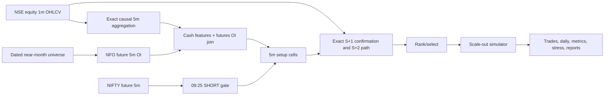
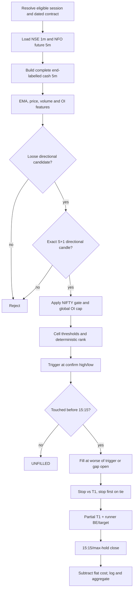
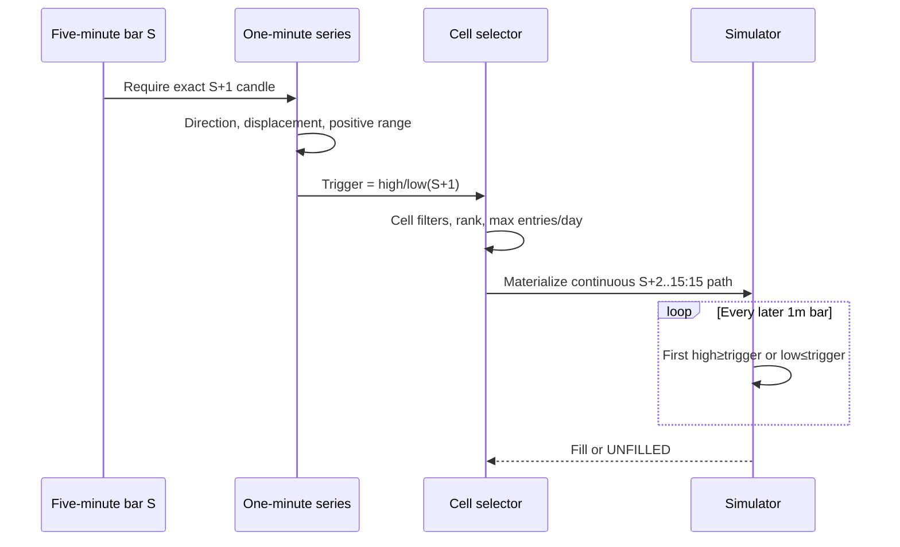
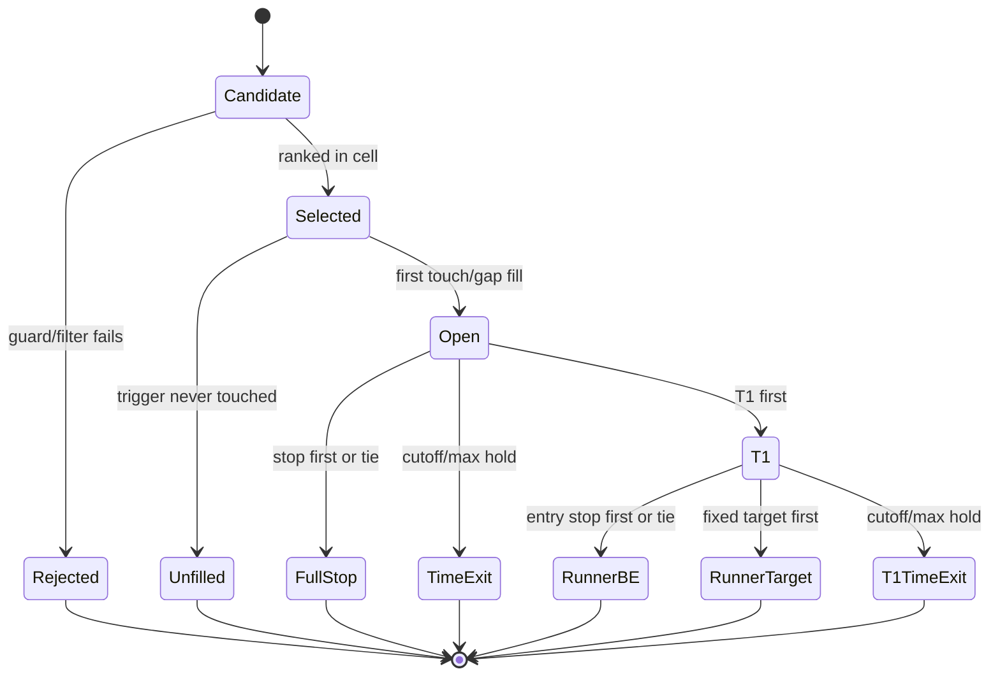
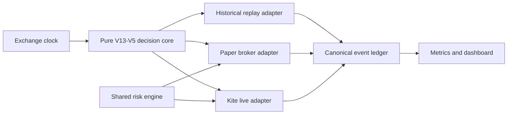
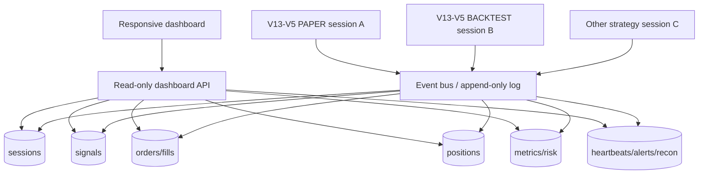
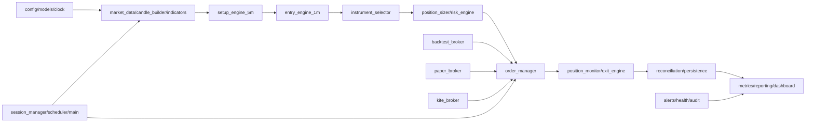
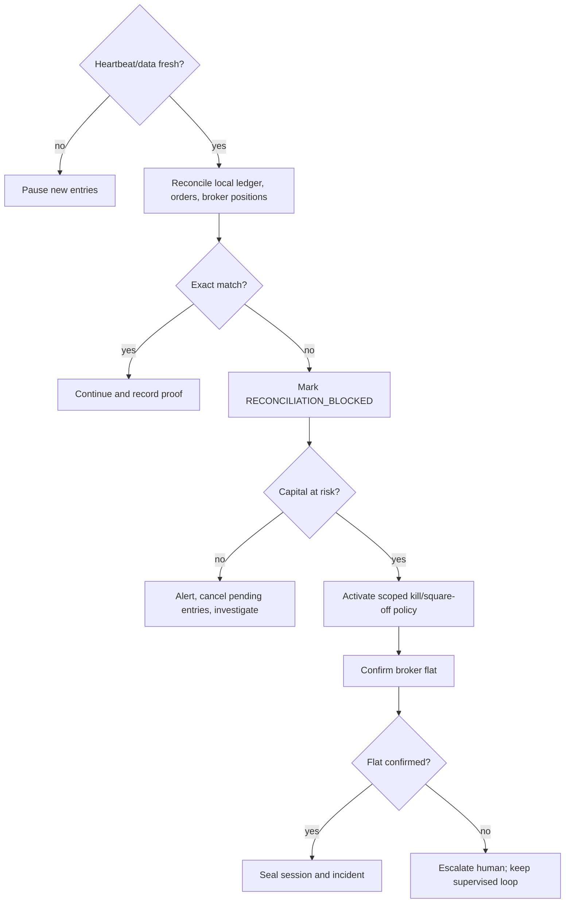

# Corrected V13-V5 F&O Trading System

## 1. Title page

**Complete technical, operational, and results audit**  
Strategy: `FNO_V13_CORRECTED_V5_RESEARCH_20260904_ENTRY_S10`  
Configured default: `higher_frequency`  
Evidence status: **EXPERIMENTAL_SHADOW_NOT_PRODUCTION_PROMOTED**  
Report version: 1.1 (updated for the S+10 entry-delay cap; see Appendix D)  
Generated: 2026-09-04T16:08:32+05:30  

> **Risk warning:** This document describes historical research and a proposed safety architecture. It does not guarantee future results, authorize trading, or recommend deploying capital. No broker login or order was performed.

## 2. Document metadata

| Field | Value |
| --- | --- |
| Exact main source | `C:\Users\Saarit\OneDrive\Desktop\Trading\backtesting\eqidv2\backtesting\eqidv2\fno_v13_corrected_v5_backtest.py` |
| Main source SHA-256 | `f844169f763f38f2c5befaa340b45af6bd3c2c67b1a5b8e2afcc0dcbda365ffe` (changed 2026-09-04; see Appendix D) |
| Frozen V13-V3 SHA-256 | `85c2ff1c37a342e8e0bc4b73eb115de8ebc5aa7e990db261e46036b68aeafbab` (unchanged) |
| Result provenance | `C:\TradingData\eqidv2\fno_oi\strategy_research\v13_corrected_v5\fno_v13_corrected_v5_provenance.json` |
| Provenance SHA-256 | `e9d5b2f74b4e07c740e4676c5ae2ec32cbd745056764142dd2a66b4c9e165aa9` |
| Artifact generated at | `2026-09-04T16:08:32+05:30` |
| Data through | `2026-09-03` |
| Backtest rerun for this report | **Yes.** `fno_v13_corrected_v5_backtest.py --profile all` was rerun after the S+10 entry-delay-cap edit (see Appendix D); this report's numbers are from that run, not read from stale artifacts. |
| Verification run | Full profile run completed in 8.0s off the verified candidate cache (26AUG/26SEP regimes unchanged — only post-cache entry logic changed); `V13_V3_CORRECTED_UNIFORM_1515` reproduced byte-identical to the pre-edit run (78 fills, PF 2.803463, net +46.655362%), confirming the cap did not leak into the frozen V13-V3 comparator path. |
| Confirmed bugs/config defects | **1** |
| Live-readiness blockers | **10** (R03 downgraded from blocker to open research item; see §21) |
| Overall verdict | **Not ready for paper trading**; suitable only for offline replay/research until P0/P1 gates close. |

### Table of contents

1. [Title page](#1-title-page)
2. [Document metadata](#2-document-metadata)
3. [Executive summary](#3-executive-summary)
4. [One-page strategy brief](#4-one-page-strategy-brief)
5. [Repository and source map](#5-repository-and-source-map)
6. [System architecture](#6-system-architecture)
7. [Complete end-to-end flow](#7-complete-end-to-end-flow)
8. [Data and candle construction](#8-data-and-candle-construction)
9. [Five-minute setup logic](#9-five-minute-setup-logic)
10. [One-minute entry logic](#10-one-minute-entry-logic)
11. [Instrument and strike selection](#11-instrument-and-strike-selection)
12. [Entry execution model](#12-entry-execution-model)
13. [Position sizing and capital model](#13-position-sizing-and-capital-model)
14. [Stop-loss, target, trailing, and exit logic](#14-stop-loss-target-trailing-and-exit-logic)
15. [Guards and safety rails](#15-guards-and-safety-rails)
16. [Trade-state machine](#16-trade-state-machine)
17. [Timing and session behavior](#17-timing-and-session-behavior)
18. [Backtesting implementation](#18-backtesting-implementation)
19. [Backtest results and validation](#19-backtest-results-and-validation)
20. [Trade-level worked examples](#20-trade-level-worked-examples)
21. [Inaccuracies, bugs, and problem register](#21-inaccuracies-bugs-and-problem-register)
22. [Backtest versus paper versus live differences](#22-backtest-versus-paper-versus-live-differences)
23. [Kite Connect integration design](#23-kite-connect-integration-design)
24. [Multi-session dashboard design](#24-multi-session-dashboard-design)
25. [Proposed micro-file and service architecture](#25-proposed-micro-file-and-service-architecture)
26. [Time-bound scheduling and lifecycle management](#26-time-bound-scheduling-and-lifecycle-management)
27. [Monitoring, alerts, and reconciliation](#27-monitoring-alerts-and-reconciliation)
28. [Deployment and rollback plan](#28-deployment-and-rollback-plan)
29. [Improvement roadmap](#29-improvement-roadmap)
30. [Final readiness assessment](#30-final-readiness-assessment)
31. [Glossary](#31-glossary)
32. [Appendices](#32-appendices)

### Evidence labels used

- **Verified:** observed directly in code, checksummed artifact, or passing test.
- **Inferred:** logical consequence of verified code, explicitly labelled.
- **Comment-only:** statement found only in prose/comment, not executable behavior.
- **Missing / not implemented:** required capability was not found in V13-V5.
- **Recommended:** future design; it is not current behavior.

## 3. Executive summary

V13-V5 is an **intraday stock-direction research backtest**, not a complete options trading system. It uses NSE cash-equity one-minute OHLCV for price, confirmation, entry and exit; it joins only open interest from a mapped near-month NFO stock future. A bullish or bearish five-minute EMA-aligned move with rising OI and volume becomes a candidate. A strict directional one-minute candle immediately after the five-minute candle creates a stop-entry trigger. **As of 2026-09-04 the trigger must be touched within 10 minutes of that confirmation candle's close or the candidate is discarded as `UNFILLED`** — previously the trigger stayed live all the way to the 15:15 cutoff (see Appendix D). The default higher-frequency profile ranks candidates within each configured time/side cell, then simulates a two-stage exit: 10% at +1.075%, move the 90% runner stop immediately to entry, seek +2.60%, and otherwise close at 15:15. [SRC-DATA], [SRC-SIGNAL], [SRC-V5-MAIN]

On 25 sessions from 2026-07-29 through 2026-09-03, the default profile produced 91 selected orders, **83 fills** (8 `UNFILLED`, of which 6 are candidates that would have filled late under the old unbounded window and are now excluded by the S+10 cap; 2 never touch their trigger at all before 15:15 regardless of any window), 60 wins, a **72.29%** win rate, a **56.63%** first-target rate, **PF 3.270**, and **+49.577** percentage points of arithmetic net trade returns after a flat 5 bps per fill assumption. Maximum drawdown on the summed daily-return curve was **−3.072** percentage points. These are **not account returns**: there is no quantity, capital, margin, compounding, portfolio overlap, or rupee P&L model. [SRC-V5-MAIN: `metrics`, lines 1016–1126]

Strengths are causal S+1 confirmation, exact S+2-to-15:15 continuous minute paths, point-in-time contract regimes, hash-pinned inherited code, isolated caches, pessimistic stop-first handling for same-bar ambiguity, gap-aware actual-open entry and adverse stop fills, and unusually explicit result provenance. The most serious remaining weaknesses are the absence of a tradable contract/strike model, position sizing and portfolio risk, realistic costs/spreads/partial fills, and any V13-specific paper/live state and reconciliation engine. **The entry window is no longer unbounded** — a 10-minute cap now exists, selected via a TRAIN+VALIDATION grid search over S+1..S+60 as the best-performing finite cutoff — but this is a considered research choice, not a proven improvement: on the same TRAIN+VALIDATION evidence it used to select itself, the cap does not beat the old unbounded behaviour (combined net 36.09 vs 36.36 points), so it should be read as "a bound now exists and is defensible," not "the bound is validated." The apparent validation is only 25 already-inspected sessions: the last six are labelled pseudo-test, not untouched test.

**Readiness:** not ready for paper trading as a faithful V13-V5 strategy because a paper broker cannot know what contract or quantity to simulate, and critical lifecycle/risk rules are absent. It is ready for offline historical replay. It is not ready for live trading.

**Next three actions:** (1) freeze a genuinely unseen dataset and pre-register metrics; (2) decide and test the executable instrument contract—cash equity, stock future, or options with explicit expiry/strike/premium mapping; (3) implement a locked paper adapter with risk sizing, trigger expiry, order-state persistence, reconciliation and kill switches, then prove replay parity.

## 4. One-page strategy brief

### V13-V5 in 60 seconds

| Question | Answer |
| --- | --- |
| What is scanned? | Point-in-time mapped F&O underlyings, using NSE cash-equity OHLCV and NFO near-month futures OI. |
| What makes a setup? | EMA9/20/50 trend alignment, directional five-minute price change, positive OI change, volume ratio, then timing-specific body/wick thresholds. |
| What confirms entry? | The exact next one-minute candle: bullish and above the 5m close for LONG; bearish and below it for SHORT. |
| Trigger | Confirmation high for LONG, confirmation low for SHORT. Must be touched within **10 minutes** of the confirmation candle's close (`MAX_ENTRY_DELAY_MINUTES`, added 2026-09-04) or the candidate is discarded. |
| Selection | Per timing/side/day deterministic rank (`max_liquidity`, `max_move`, or `max_volume`) and `max_entries` 1–2. |
| Special market guard | Only the 09:25 SHORT cell requires NIFTY near-month first-bar return ≤ −0.05%. |
| Default exit | 1.50% stop; 10% at +1.075%; 90% runner at +2.60% with immediate breakeven stop; 15:15 time exit. |
| Current headline | 83 fills, 72.29% wins, 56.63% T1 hits, PF 3.270, +49.577 summed net return points, −3.072 max drawdown points. |
| What is missing? | Contract/strike, option premium, lot size, quantity, margin/capital, spread/depth, broker order state, recovery, reconciliation and production risk controls. |

Plain-language sequence: the five-minute layer decides **which stock and direction are interesting**; the exact following minute decides **the breakout level**; subsequent one-minute cash bars decide **if and when the synthetic order fills and exits, within a bounded 10-minute entry window**. The exit is not a trailing stop: it is a fixed breakeven runner stop. [SRC-SIGNAL: lines 271–351; SRC-V5-MAIN: lines 683–713 and 849–985]

## 5. Repository and source map

### Source catalog

| ID | File | Location | Runtime role |
| --- | --- | --- | --- |
| SRC-V5-MAIN | fno_v13_corrected_v5_backtest.py | 41–70, 74–145, 177–245, 418–588, 591–713, 726–990, 993–1150, 1195–1300, 1435–1543, 2078–2135 | Version/profile/cache, selection, entry/fill, exits, metrics, validation and CLI |
| SRC-V3 | fno_v13_corrected_v3_backtest.py | 41–60, 126–181, 184–267, 420–452 | Inherited setup book, NIFTY first-bar context/gate |
| SRC-V2 | fno_v13_corrected_v2_backtest.py | 80–130, 170–257 | OI policy, global 1.00% cap, added 09:55 template |
| SRC-V6 | fno_v6_corrected_backtest.py | 183–271, 383–408 | Point-in-time rolling near-month session eligibility and regime concatenation |
| SRC-SIGNAL | fno_oi_ema_confirm_sweep.py | 50–71, 77–102, 169–357 | Loose causal candidate cache, EMA/OI direction, strict S+1 confirmation, S+2 path |
| SRC-DATA | fno_oi_hybrid_data.py | 18–39, 316–377, 391–457 | NSE 1m → exact end-labelled 5m; features; futures-OI-only join |
| SRC-SELECT | fno_v5_hybrid_backtest.py | 1–73 | Threshold predicates, deterministic ranking and per-day max entries |
| SRC-PROV | fno_oi_backtest_provenance.py | 86–168, 239–336 | Dated universe resolution and stored-data provenance |
| SRC-COMMON | fno_oi_common.py | 25–29, 438–468, 502–577 | Runtime F&O roots, registry, dated universe and raw contract paths |
| SRC-PATHS | eqidv2_runtime_paths.py | 7–63 | Environment-controlled runtime roots |
| SRC-TEST | tests/test_fno_v13_corrected_v5_backtest.py | 1–end | Hash pinning, exact profiles, gap fills, stop-first ambiguity, path completeness, metric meaning |
| SRC-PAPER | fno_multi_paper_profiles.py; fno_multi_paper_session.py; fno_multi_paper_engine.py | profiles 20, 119; session 44, 800–840; engine state/order sections | Reusable V10/V11/V12 paper-only patterns; not wired to V13-V5 |
| SRC-LIVE | fno_v6_live.py; fno_v6_live_config.py; fno_v6_live_kite_session.py | config 21, 80–81, 117–321; session/order callbacks | Existing V6 safety/arming/Kite patterns; not V13-V5 |
| SRC-DASH | log_dashboard_server.py | 9076–9079, 9928–9958, 10639–10658, 12101–12251 | Existing multi-paper cards, kill controls, status and heartbeat; no V13 adapter |
| SRC-SCHED | eqidv2_eod_scheduler_for_1min_data_live.py | 29, 253–284, 326–412 | Existing centralized slot builder/status heartbeat; not V13 lifecycle |

### Relationship map

`fno_v13_corrected_v5_backtest.py` imports V13-V3, V13-V2, corrected V6, the signal builder, hybrid data adapter, selector/replay helper, provenance and common paths. The main source pins V13-V3 by SHA-256 and refuses drift; V13-V3 in turn pins V13-V2, which pins corrected V6. Outputs are isolated under `C:/TradingData/eqidv2/fno_oi/strategy_research/v13_corrected_v5`. [SRC-V5-MAIN: lines 35–70, 177–190]

Data/configuration sources:

- `EQIDV2_RUNTIME_ROOT` defaults to `C:/TradingData/eqidv2`; `EQIDV2_DATA_5M_DIR`, `EQIDV2_DATA_1MIN_DIR`, `EQIDV2_REPORTS_DIR`, `EQIDV2_LIVE_SIGNALS_DIR`, cache/status variables may override subpaths. [SRC-PATHS]
- V13 hybrid research additionally reads `EQIDV2_FNO_V5_BACKTEST_EQUITY_5M_DIR` and `EQIDV2_FNO_V5_BACKTEST_EQUITY_1M_DIR`, defaulting under the runtime root. [SRC-DATA: lines 24–37]
- Strategy parameters are dataclasses/constants and CLI flags (`--profile`, `--through-day`, `--cost-bps`, `--cutoff`, cache/eligibility refresh flags), not a separate V13-V5 config file. `--cutoff` must normalize to `1515`. [SRC-V5-MAIN: lines 74–145, 2078–2105]
- Instrument masters are dated `near_month_YYYY-MM-DD.parquet` files plus `contract_registry.parquet`; raw futures/NIFTY data are under `fno_oi/raw_contracts_5m`. [SRC-COMMON], [SRC-PROV]
- V13-V5 has no runtime log schema, paper runner, live runner, dashboard adapter, batch launcher, scheduled task or service definition. Existing V6/V8/multi-paper/dashboard/scheduler code is version-specific reference material only. [SRC-PAPER], [SRC-LIVE], [SRC-DASH], [SRC-SCHED]
- Credential-named files exist in the workspace but were deliberately not opened. No secret is needed or appropriate for this report.

### Authoritative result artifacts

The authoritative headline is `fno_v13_corrected_v5_profile_comparison.csv`, tied to the provenance JSON and per-profile trades/daily/setups/breakdowns/stress/sensitivity/walk-forward/bootstrap CSVs. Research folders contain 1,529 recorded experiments plus rejection ledgers; they are supporting research, not independent test results. The two verified cache regimes contain 2,824 (`26AUG`) and 1,201 (`26SEP`) strict candidate rows. [Result provenance JSON]

## 6. System architecture



The executable architecture is a single offline Python process. Price and volume never come from the future; future data contributes only OI. Candidate selection is followed by raw one-minute path rematerialization before execution. There is no broker or dashboard node in the current V13-V5 runtime. [SRC-DATA], [SRC-V5-MAIN: lines 517–588, 2114–2135]

## 7. Complete end-to-end flow



Stage contract: raw inputs must contain finite complete OHLCV; output is rejected/selected order/fill/trade. Missing exact confirmation is skipped during candidate construction; selected execution paths fail closed if confirmation, first forward minute, continuous sequence or exact 15:15 is missing. Ranking ties resolve by traded value then symbol. [SRC-DATA: 316–377; SRC-SIGNAL: 271–351; SRC-SELECT; SRC-V5-MAIN: 618–680]

### Source-faithful pseudocode

```text
for eligible session using its point-in-time near-month mapping:
    cash_5m = aggregate exactly five real NSE 1m rows, end-labelled
    features = EMA9/20/50, prior-close return, prior-20-volume ratio, traded value
    join future OI at identical timestamp; require positive current/prior OI
    for 09:25..15:00 loose bullish/bearish candidates:
        require exact next minute S+1 and positive range
        LONG: close(S+1) > open(S+1) and close(S+1) > close(S)
        SHORT: close(S+1) < open(S+1) and close(S+1) < close(S)
        trigger = high(S+1) for LONG else low(S+1)
apply 09:25 SHORT NIFTY first-bar <= -0.05% gate
apply global OI change <= 1.00%
for each configured time/side cell:
    filter by price, OI, volume, body, directional wick, traded-value thresholds
    rank within day and retain cell max_entries
for each selected order:
    rebuild exact cash path S+2..15:15
    first trigger-touch fills at trigger, unless bar opens through trigger (use open)
    create 1.50% stop, 1.075% T1, 2.60% runner target from actual fill
    stop wins any T1 tie; if T1 first, realize 10%, move 90% runner stop to entry
    runner stop wins runner-target tie; otherwise exit at target or final close
    net_return_pct = weighted gross_return_pct - cost_bps / 100
aggregate arithmetic trade and daily percentage points; do not infer rupee/account P&L
```

## 8. Data and candle construction

The cash one-minute timestamp is treated as **candle end** in IST. Minute offsets 1–375 from 09:15 are eligible. A five-minute bar ending 09:25 is exactly 09:21–09:25; its OHLCV is first/max/min/last/sum. Groups not containing exactly five rows with first `end−4m` and last `end` are dropped. Rows flagged `gap_filled`, `opening_snapshot`, or `provisional_stale`, non-finite OHLCV, adjacent copied OHLCV, and invalid OI pairs are excluded. [SRC-DATA: lines 300–377]

Features:

```text
EMA_s[t] = EWM(close, span=s, adjust=False), s ∈ {9,20,50}
price_change_pct[t] = (close[t] / close[t-1] - 1) × 100
volume_ratio[t] = volume[t] / mean(volume[t-20:t-1]), min 5 prior bars
traded_value[t] = close[t] × volume[t]
oi_change_pct[t] = (OI[t] / OI[t-1] - 1) × 100
```

Verified limitation: the volume rolling window is not grouped/reset by session, so early bars can use prior-session bars. This is causal but may not match an intended same-session relative-volume definition. The join is an exact inner one-to-one timestamp merge. Timezone-naive inputs are localized to IST; aware inputs are converted. Data arrival lateness is not simulated; incomplete five-minute bars drop, while incomplete selected exit paths abort the run. [SRC-DATA: 398–441]

## 9. Five-minute setup logic

General direction gate before profile thresholds: LONG requires `EMA9 > EMA20 > EMA50`, rising valid OI, `oi_change_pct ≥ 0.05`, `volume_ratio ≥ 0.8`, and price change ≥ +0.10%; SHORT mirrors EMA order and price ≤ −0.10%. This loose gate builds a reusable superset. Profile filters below are stricter. [SRC-SIGNAL: lines 50–71, 231–240]

| 5m end | Confirm end | Side | Max/day | Picker | \|Price\| % | OI min % | Vol ratio | Body min | Wick max | Min value | Observed orders/fills and results |
| --- | --- | --- | --- | --- | --- | --- | --- | --- | --- | --- | --- |
| 09:25 | 09:26 | LONG | 1 | max_liquidity | 0.300 | 0.100 | 3.00 | 0.60 | 0.60 | 0 | 11/10; WR 80.0%; T1 80.0%; PF 11.09; net 9.485% |
| 09:25 | 09:26 | SHORT | 2 | max_volume | 0.200 | 0.100 | 1.50 | 0.40 | 0.60 | 0 | 12/10; WR 90.0%; T1 40.0%; PF 7.64; net 5.496% |
| 09:30 | 09:31 | LONG | 1 | max_move | 0.650 | 0.100 | 1.00 | 0.50 | 0.60 | 0 | 7/7; WR 71.4%; T1 71.4%; PF 6.32; net 9.541% |
| 09:30 | 09:31 | SHORT | 1 | max_move | 0.200 | 0.250 | 1.00 | 0.40 | 0.60 | 0 | 5/5; WR 100.0%; T1 40.0%; PF ∞; net 3.269% |
| 09:35 | 09:36 | LONG | 1 | max_liquidity | 0.200 | 0.150 | 1.00 | 0.60 | 0.60 | 0 | 9/9; WR 66.7%; T1 55.6%; PF 1.45; net 1.466% |
| 09:35 | 09:36 | SHORT | 2 | max_liquidity | 0.500 | 1.000 | 1.00 | 0.40 | 0.60 | 0 | 0/0; WR N/A%; T1 N/A%; PF N/A; net 0.000% |
| 09:40 | 09:41 | LONG | 1 | max_liquidity | 0.200 | 0.075 | 2.00 | 0.50 | 0.60 | 0 | 8/8; WR 50.0%; T1 50.0%; PF 1.18; net 0.746% |
| 09:40 | 09:41 | SHORT | 1 | max_move | 0.200 | 0.100 | 1.00 | 0.40 | 0.60 | 0 | 7/7; WR 57.1%; T1 42.9%; PF 0.94; net -0.278% |
| 09:45 | 09:46 | LONG | 1 | max_move | 0.650 | 0.100 | 1.00 | 0.40 | 0.60 | 0 | 2/2; WR 50.0%; T1 50.0%; PF 1.69; net 0.443% |
| 09:45 | 09:46 | SHORT | 1 | max_volume | 0.200 | 0.750 | 1.00 | 0.40 | 0.40 | 0 | 0/0; WR N/A%; T1 N/A%; PF N/A; net 0.000% |
| 09:55 | 09:56 | LONG | 1 | max_liquidity | 0.200 | 0.100 | 1.00 | 0.40 | 0.60 | 0 | 10/8; WR 62.5%; T1 62.5%; PF 3.39; net 6.704% |
| 10:00 | 10:01 | LONG | 1 | max_liquidity | 0.400 | 0.050 | 1.00 | 0.40 | 0.60 | 0 | 9/8; WR 62.5%; T1 62.5%; PF 3.71; net 6.339% |
| 09:50 | 09:51 | SHORT | 1 | max_liquidity | 0.200 | 0.100 | 1.00 | 0.40 | 0.60 | 0 | 5/4; WR 75.0%; T1 50.0%; PF 5.22; net 1.846% |
| 11:20 | 11:21 | SHORT | 1 | max_liquidity | 0.200 | 0.100 | 1.00 | 0.40 | 0.60 | 0 | 6/5; WR 100.0%; T1 60.0%; PF ∞; net 4.519% |

Fills column is **post-S+10-cap** (2026-09-04; see Appendix D): only two cells actually lost fills to the cap — 09:25 LONG (11→10, one fill exceeded 10 minutes) and 09:25 SHORT (12→10, two fills exceeded it) — plus 09:55 LONG (10→8, including the 137-minute PAYTM outlier from §10's original delay statistics) and 09:50 SHORT (5→4). The other ten cells are unaffected because none of their individual fills happened to wait past 10 minutes.

All times are **candle-end/evaluation times**, not opens. The confirm candle is the exact next minute; entry starts one minute after confirmation and must fill within 10 minutes of confirmation or the candidate is discarded (added 2026-09-04). The default profile adds 09:50 SHORT and 11:20 SHORT, and adds +0.10 to inherited wick caps (capped at 1.0). The global OI cap remains ≤1.00% before cell ranking. Only 09:25 SHORT has the NIFTY guard. [SRC-V5-MAIN: `profile_setups`; SRC-V3: `annotate_nifty_gate`; SRC-V2: `apply_policy`]

There is no cross-cell cooldown, global daily cap, direction lock or duplicate-symbol suppression. A symbol may be selected in more than one cell, and each trade is simulated independently. The sum of per-cell maxima is 16 potential orders/day; observed maximum was 8. The 09:35 SHORT rule has OI minimum 1.00% and global maximum 1.00%, so only exact-boundary values can pass; it produced zero orders. No expiry-day special logic exists, and all 83 observed fills were non-expiry-day.

## 10. One-minute entry logic



Chronology is exact: a 09:25 five-minute signal uses only data through 09:25; 09:26 must be present and is the strict confirmation; first entry-eligible bar is 09:27. LONG confirmation requires green candle and close above the signal close; SHORT requires red candle and close below. Body ratio is `abs(close-open)/(high-low)`. Directional wick ratio is upper wick/range for LONG and lower wick/range for SHORT. These morphology fields are **selection filters on the confirmation candle**, not additional later confirmations. [SRC-SIGNAL: 271–351]

**Finite entry window implemented 2026-09-04** (previously missing; see Appendix D): the trigger search is now bounded to the first 10 minutes after the confirmation candle's close (`MAX_ENTRY_DELAY_MINUTES = 10`, applied to `simulate_scaleout`, i.e. every V13-V5 profile). A candidate whose trigger is not touched within that window is discarded as `UNFILLED`, exactly as if the trigger had never been hit at all — there is no partial credit and no re-queuing. The frozen `V13_V3_CORRECTED_UNIFORM_1515` comparator path (`simulate_native`) deliberately keeps the **old unbounded** default so it still reproduces V13-V3's published figures exactly; only the three V13-V5 profiles are capped. Still not implemented: explicit signal expiration as a *rejection reason distinct from* a timed-out trigger, pullback/retest/reclaim, trigger buffer, anti-chase maximum, ATR control, one-minute volume requirement, VWAP/AVWAP/reference-distance guard, premium/spread/depth, second chance, re-entry state, duplicate-order lock. Default trigger buffer and worse-fill slippage are 0; optional stress parameters exist but are not the headline run. [SRC-V5-MAIN: 683–713, 849–858, `MAX_ENTRY_DELAY_MINUTES`]

Observed trigger delay (post-cap, 2026-09-04): median/75th percentile = 1 minute; mean 1.30; maximum 7 minutes — every fill now lands inside the 10-minute window by construction, so no fill can exceed it. Of the 91 selected orders, 8 are `UNFILLED`: 6 are candidates whose trigger *would* have touched eventually under the old unbounded scan (the pre-cap run filled 89/91) but not within 10 minutes — including the three latest outliers from the original unbounded run: PAYTM 2026-08-21 (was 137 minutes), BSE 2026-08-12 (was 95 minutes), and JSWSTEEL 2026-07-29 (was 68 minutes), all now excluded. The remaining 2 never touch their trigger before 15:15 under any window and were `UNFILLED` before this change too.

**Why 10 minutes, not something else:** the cutoff was chosen by a TRAIN+VALIDATION grid search over S+1 through S+60 minutes (research-only harness, not part of `fno_v13_corrected_v5_backtest.py`'s own test suite). S+10 was the best-performing *finite* cutoff on that evidence (VALIDATION PF 2.72 vs 2.38 uncapped), and it strictly dominates every wider cutoff tested (S+15, S+20, ...). It does **not**, however, beat the old unbounded behaviour on the same TRAIN+VALIDATION combination it was selected on (combined net 36.09 vs 36.36 points) — the honest characterization is "the best defensible finite window," not "an improvement over no window at all." See R03 in §21 for the full evidence trail.

### Funnel

| Stage | Count | Definition |
| --- | ---: | --- |
| Strict-confirmed cache rows | 4,025 | 2,824 AUG-regime + 1,201 SEP-regime candidate records; broad reusable time/side superset, not unique configured setups. |
| Configured setup rules | 14 | Higher-frequency time/side cells. |
| Selected synthetic orders | 91 | After NIFTY/OI/cell thresholds and per-day ranking. |
| Valid continuous entry paths | 91 | All selected rows passed exact S+2..15:15 rematerialization. |
| Filled trades | 83 | Trigger touched within the 10-minute window; 8 remained `UNFILLED` (6 by the new cap, 2 never touch regardless). |
| Winners / losers | 60 / 23 | Net trade return >0 / <0 after flat cost. |
| First-target hits | 47 | 56.63% of fills; includes runner, T1→BE and T1→time outcomes. |
| Runner-target hits | 19 | 22.89% of fills. |

## 11. Instrument and strike selection

**Missing / not implemented.** The universe maps an equity symbol/token to a near-month futures symbol/token for OI. The selected/entered/exited instrument remains the NSE cash equity. The output explicitly writes `instrument_kind=NSE_CASH_EQUITY_WITH_FUTURES_OI`, `ce_pe=NOT_APPLICABLE`, and `strike_type=NOT_APPLICABLE`. There is no option expiry, strike, CE/PE, premium, lot size, option spread or option liquidity selection. [SRC-SIGNAL: 321–350; SRC-V5-MAIN: 1208–1255]

Therefore “successful CE/long” and “PE/short” below mean **directional analogues only**. A future implementation must first choose one contract: (a) NSE cash equity execution, (b) NFO stock future execution, or (c) long/short option execution. These are economically different strategies; mapping the current percentage stop/targets onto option premium would alter behavior and requires a new validation, not a wiring-only change.

## 12. Entry execution model

For LONG, a bar touches when `high ≥ trigger`; SHORT when `low ≤ trigger`. Fill equals trigger unless the eligible bar opens through it; then actual open is used. Optional worse-fill stress adjusts LONG upward and SHORT downward. The first touch is accepted without volume-at-price, queue, spread, tick-size or market-depth validation. [SRC-V5-MAIN: `_entry`, 683–713]

`entry_price = gap_open if adverse breakout gap else buffered_trigger`. Brackets are rebased to actual fill. A later stop gap fills at the adverse bar open; on the activation bar, the stop level is used because OHLC cannot order the open and intrabar trigger. Target gaps still fill at the target level, not a favorable open. This is conservative for favorable gaps and stop-first ambiguity, but optimistic about stop-entry liquidity. [SRC-V5-MAIN: 726–748, 849–985; SRC-TEST]

Same-minute entry/exit is allowed because exit scans include the entry bar. If its range covers stop and T1, stop wins. No tick is required at the trigger/target; OHLC touch is treated as executable. There is no order rejection, partial fill, cancellation, manual intervention or restart behavior in backtest.

## 13. Position sizing and capital model

Current implementation has **no quantity, capital, margin, lot, compounding or rupee P&L**. `net_profit` is deliberately `N/A_NO_CAPITAL_OR_POSITION_SIZE_MODEL`; “net_profit_pct” is a simple sum of per-trade percentage returns. Maximum observed synthetic concurrency was 7 positions, but capital was not reserved for them. [SRC-V5-MAIN: `metrics`, lines 1090–1105]

Recommended formulas for a future executable instrument:

```text
risk_budget_per_trade = available_capital × permitted_risk_fraction
risk_per_unit = abs(entry_price - protective_stop_price)
risk_per_lot = risk_per_unit × lot_size + estimated_round_trip_charges + adverse_slippage
permitted_lots = floor(risk_budget_per_trade / risk_per_lot)
quantity = permitted_lots × lot_size
required_capital = broker_margin_or_premium + simultaneous_position_reserve
                  + stress_drawdown_reserve + operational_cash_buffer
```

Illustrative scenarios only—not recommendations:

| Scenario | Hypothetical capital | Trade risk | Daily risk | Stop/lot/extra costs | Formula result | Other constraints |
| --- | ---: | ---: | ---: | --- | --- | --- |
| Conservative | ₹10,00,000 | 0.25% = ₹2,500 | 0.75% = ₹7,500 | ₹12 × 100 + ₹300 = ₹1,500/lot | floor(2,500/1,500) = 1 lot | Max 2 positions; 15% cash buffer; ≥10% stress-DD reserve. |
| Moderate | ₹20,00,000 | 0.50% = ₹10,000 | 1.50% = ₹30,000 | ₹10 × 200 + ₹400 = ₹2,400/lot | floor(10,000/2,400) = 4 lots | Max 3 positions; margin API pre-check; reduce if correlated. |
| Aggressive | ₹30,00,000 | 0.75% = ₹22,500 | 2.25% = ₹67,500 | ₹15 × 300 + ₹600 = ₹5,100/lot | floor(22,500/5,100) = 4 lots | Research illustration only; higher gap/slippage and capacity risk. |

If buying options, use the option-premium stop distance and lot size; if selling options/futures, broker margin and gap loss can dominate nominal stop risk. Query current order/basket margins and charges immediately before approval. Expiry-day gamma/liquidity requires a larger reserve or explicit exclusion. Scaling can worsen queue, slippage, freeze-quantity slicing and market impact; position size must follow risk, not desired profit.

## 14. Stop-loss, target, trailing, and exit logic

Default higher-frequency `ExitSpec`: initial stop 1.50%, T1 +1.075%, partial 10%, runner target +2.60%, runner stop `BREAKEVEN`, no maximum holding minutes. LONG levels multiply entry by `1−/+pct`; SHORT reverses signs. Weighted gross after T1 is `0.10×1.075 + 0.90×runner_return`. Net subtracts `cost_bps/100`, i.e. 5 bps becomes 0.05 percentage point once per filled trade. [SRC-V5-MAIN: 74–145, 849–985]

Exact priority:

1. Before T1: no stop and no T1 → final close; stop index ≤ T1 index → full stop; otherwise T1.
2. After T1: runner stop is actual entry immediately. Neither runner event → final close; BE index ≤ runner target index → breakeven runner; otherwise fixed runner target.
3. A later adverse stop gap uses the bar open. A target uses the exact target level.
4. Higher-frequency always uses exact 15:15 final close. Conservative may end at 180 minutes.

“Trailing stop” is **not implemented** (`trailing_stop_exits=0`). No stop ratchet follows favorable price. Emergency exit, data-failure exit, broker rejection, manual intervention and restart recovery are absent. Per-cell `stop_pct`/`target_pct` are stored as `native_*` comparator fields but the V5 scale-out headline ignores them in favor of the global profile exit—an important configuration clarity issue.

## 15. Guards and safety rails

| Guardrail | Current? | Location / threshold | Purpose and adequacy | Recommended enhancement |
| --- | --- | --- | --- | --- |
| Session eligibility | Yes | V5 `load_market`; coverage ≥0.99, mapped contract and stored future rows | Fails closed at session selection; good for stored OI presence, not execution data quality | Require per-symbol cash/future freshness/completeness manifest |
| Exact candle completion | Yes | Hybrid exact five real 1m rows | Prevents provisional/gap-filled 5m bars | Mirror identical live seal rules and late-data quarantine |
| Confirmation/path completeness | Yes | Exact S+1; selected S+2..15:15 continuous | Strong offline fail-closed check | Live stale-clock SLA and gap recovery |
| Trading session limit | Partial | Signals configured 09:25–11:20; exit cutoff 15:15; **trigger life bounded to 10 minutes post-confirmation (added 2026-09-04)** | Bounded trigger life now exists (was previously fully unbounded); still no explicit new-entry cutoff near close, and the 10-minute value itself is a research choice, not independently validated | Cell-specific expiry values (rather than one global constant); forbid new fills near close; validate the 10-minute choice on genuinely unseen sessions |
| Maximum entries/day | Per cell only | `max_entries` 1–2; sum 16; observed max 8 | Does not cap portfolio load | Global per-session/per-symbol cap |
| Maximum open positions | No | Observed overlap 7; not modeled | Capital/risk can stack | Atomic portfolio exposure gate |
| Direction lock | No | No portfolio direction state | Can mix/add correlated exposures | Optional net/gross beta and side caps |
| Duplicate order prevention | Config only | Duplicate time/side rule rejected | Does not prevent duplicate symbol/order request | Idempotency key + unique DB constraint |
| Re-entry/cooldown | No | Independent setup cells | Repeated same symbol possible | Define symbol/day re-entry and cool-off |
| Daily loss | No | Not modeled | Critical capital safety gap | Hard realized+unrealized daily stop |
| Strategy drawdown | No | Metric only; no runtime brake | Cannot halt degradation | Rolling drawdown circuit breaker with approval reset |
| Per-trade risk | No | No quantity/capital | Critical | Risk-budget sizing and broker margin preflight |
| Max allocation/quantity | No | No quantities | Critical | Per-account, session, symbol and order caps |
| Liquidity/spread | No | `min_traded_value=0`; cash OHLC touch only | Inadequate | Executable instrument depth, spread, ADV and impact gates |
| Stale data | Offline partial | Flagged stored rows excluded | No live heartbeat/staleness clock | Fail closed after SLA; cancel triggers; position-only mode |
| Missing candle | Yes offline | Drop incomplete 5m; abort selected incomplete path | Good offline | Live backfill then quarantine; never synthesize signal bars |
| Extreme price/tick size | No | Finite/positive range only | No band/tick validation | Instrument-master tick rounding, circuit/price-band checks |
| Broker connectivity/rate limits | No | No broker in V13 | Blocker | Token bucket, timeout, reconnect, read-only fallback |
| Order status/partial/rejection | No | No order state | Blocker | Order update stream + polling reconciliation state machine |
| Position reconciliation | No | No broker state | Blocker | Startup and periodic broker/local/ledger three-way recon |
| Kill switch/manual pause | No V13 | Generic dashboard patterns are not wired | Blocker | Persisted global/session/symbol kill scopes, two-step UI confirmation |
| Automatic shutdown | No V13 | Backtest terminates only | Blocker | Deadline-driven position-only → square-off → reconcile → stop |
| Expiry restrictions | No | All evidence non-expiry day | Unable to verify | Explicit DTE/expiry allowlist and separate validation |
| End-of-day square-off | Backtest only | Synthetic 15:15 close | No live order/confirmation | Submit before broker cutoff, confirm flat, escalate mismatch |
| Credentials/security | N/A to backtest | No V13 live component | Unable to verify operational security | Secret store, least privilege, token redaction/rotation |

## 16. Trade-state machine



This is a replay state machine inferred from branch order in `simulate_scaleout`; no persistent runtime state machine exists. Every state lives only in the loop and emitted row. A production design must add submitted, acknowledged, partially-filled, cancel-pending, rejected, unknown and reconciliation-blocked states. [SRC-V5-MAIN: 849–990]

## 17. Timing and session behavior

| Event | Verified time/meaning |
| --- | --- |
| Cash session anchor | 09:15 IST; stored 1m bars end-labelled. |
| Earliest 5m evaluation | 09:25; 09:20 lacks prior 5m close for return. |
| Default profile setup ends | 09:25, 09:30, 09:35, 09:40, 09:45, 09:50, 09:55, 10:00, 11:20 depending on side. |
| Confirmation | Exactly one minute after each 5m end. |
| Earliest fill | Confirmation +1 minute. |
| Trigger expiry | **Confirmation +10 minutes (added 2026-09-04; was: none before 15:15 path end).** Applies to all three V13-V5 profiles via `simulate_scaleout`; the frozen `simulate_native` V13-V3 comparator path keeps the old unbounded default. |
| New-entry cutoff | Not separately implemented (distinct from trigger expiry above — new *candidates* can still be created at any configured setup time; only an already-selected candidate's own trigger window is now bounded). |
| Forced exit | Backtest final 15:15 close; conservative profile can exit at 180 minutes. |

Historical data are converted/localized to IST, but there is no centralized live exchange clock. Late/incomplete 5m bars are omitted; exact selected paths abort on incompleteness. No holiday/market-status live check exists in V13; point-in-time eligibility supplies the historical session list. [SRC-DATA], [SRC-V5-MAIN]

## 18. Backtesting implementation

The driver validates pinned sources, resolves point-in-time session regimes, loads or builds checksum-bound caches, gates/ranks signals, rematerializes opens/timestamps from raw cash one-minute data, simulates three profiles and baselines, annotates context, then writes isolated CSV/JSON/Markdown outputs. Prior-version caches may seed read-only, but V5 writes only to its own cache. Cache payload binds contract universe hash, days, cutoff, max bars, confirmation policy, data-contract version and source hashes. [SRC-V5-MAIN: 177–190, 418–514]

No-look-ahead assessment: five-minute features use current/past completed bars; S+1 confirmation occurs after S; entry path starts S+2; session dates are enforced; selection happens before exit scanning. The original selection cache omits timestamps/opens from forward HLC, so V5 rebuilds them and validates continuity. This is strong causal construction. Remaining OHLC ambiguity concerns within a one-minute bar, not future leakage.

Reproduction command (read-only historical run, but it writes isolated outputs):

```powershell
python fno_v13_corrected_v5_backtest.py --profile higher_frequency --through-day 2026-09-03 --cost-bps 5 --cutoff 15:15
```

Do not pass `--rebuild-cache` or `--refresh-eligibility` when exact artifact reproduction is desired unless source data snapshots and hashes are independently frozen. **This report version did rerun that command** (as `--profile all`, 2026-09-04T16:08:32+05:30, 8.0s, off the verified unrebuilt candidate cache) after the S+10 entry-delay-cap edit landed in source; every result in §19 is from that run, cross-checked against the `V13_V3_CORRECTED_UNIFORM_1515` comparator reproducing byte-identical to the pre-edit run.

## 19. Backtest results and validation

### Profile comparison

Post-S+10-cap (2026-09-04). V13_V3 rows are from the frozen `simulate_native` path, which keeps the old unbounded default and is therefore byte-identical to the pre-cap run — the numbers below confirm the cap did not leak into that comparator.

| Strategy/profile | Rules | Fills | Trades/day | Win % | T1 % | Runner % | PF | Net points % | Max DD % |
| --- | --- | --- | --- | --- | --- | --- | --- | --- | --- |
| V13_V3_OFFICIAL_PUBLISHED | 12 | 78 | 3.12 | 56.41 | 21.79 | 21.79 | 2.770 | 46.034 | -3.041 |
| V13_V3_CORRECTED_UNIFORM_1515 | 12 | 78 | 3.12 | 56.41 | 21.79 | 21.79 | 2.803 | 46.655 | -3.041 |
| V13_V5_BALANCED | 13 | 78 (was 83) | 3.12 | 71.79 | 56.41 | 24.36 | 3.180 | 46.644 (was 48.750) | -3.072 |
| V13_V5_CONSERVATIVE | 10 | 63 (was 68) | 2.52 | 65.08 | 53.97 | 20.63 | 3.426 | 34.871 (was 36.675) | -2.178 |
| V13_V5_HIGHER_FREQUENCY | 14 | 83 (was 89) | 3.32 | 72.29 | 56.63 | 22.89 | 3.270 | 49.577 (was 52.298) | -3.072 |

The cap applies uniformly to all three profiles via `simulate_scaleout`'s new default (`MAX_ENTRY_DELAY_MINUTES = 10`), not only to `higher_frequency`, which is why balanced and conservative also lose fills and net return here even though the S+1..S+60 grid search that chose "10" was run specifically against `higher_frequency`'s own trades.

### Headline detail: higher-frequency at 5 bps

Post-S+10-cap (2026-09-04):

| Metric | Value | Meaning |
| --- | ---: | --- |
| Sessions / period | 25 / 2026-07-29 to 2026-09-03 | 16 positive, 8 negative, 1 flat day. |
| Selected / filled | 91 / 83 | 8 unfilled (6 now capped past 10 minutes, 2 never touch regardless); 3 entry gap-through fills. |
| Wins / losses / breakeven | 60 / 23 / 0 | EOD profitable exits count as wins; wins are not target hits. |
| Win / T1 / runner hit rate | 72.289% / 56.627% / 22.892% | T1 numerator includes any first-stage touch. |
| Full stops / time-family exits / T1→BE | 9 / 45 / 10 | Stop 10.843%; no trailing exits. |
| Gross profitable / gross losing returns | +71.412 / −21.835 points | Both computed from **after-cost** trade returns despite “gross” labels. |
| Pre-cost / flat cost / net | +53.727 / −4.150 / +49.577 points | Arithmetic, not account return. |
| PF / expectancy | 3.270 / +0.597% per fill | PF = sum positive net / absolute sum negative net. |
| Avg win / avg loss / payoff | +1.190% / −0.949% / 1.254 | Percentage of synthetic cash-equity fill. |
| Max DD / duration | −3.072 points / 5 sessions | On cumulative daily arithmetic percentage points. |
| Max win/loss streak | 12 / 4 | Trade order. |
| Avg / median hold | 241.88 / 313 minutes | Long holding is driven by runner/time exits. |
| Avg MFE / MAE | +1.390% / −0.624% | From entry through selected exit bar. |

### Chronological periods

Post-S+10-cap (2026-09-04):

| Period | Days | Fills | Win % | T1 % | PF | Net % points | Expectancy % | Max DD % |
| --- | --- | --- | --- | --- | --- | --- | --- | --- |
| TRAIN | 12 | 44 (was 46) | 70.45 | 56.82 | 3.048 | 27.331 (was 28.227) | 0.621 | -1.561 |
| VALIDATION | 7 | 22 (was 24) | 72.73 | 40.91 | 2.716 | 8.762 (was 8.133) | 0.398 | -3.072 |
| PSEUDO_TEST | 6 | 17 (was 19) | 76.47 | 76.47 | 4.984 | 13.483 (was 15.938) | 0.793 | -1.600 |
| ALL | 25 | 83 (was 89) | 72.29 | 56.63 | 3.270 | 49.577 (was 52.298) | 0.597 | -3.072 |

The split was used during research; all dates were inspected. `PSEUDO_TEST` is descriptive, not untouched test. The training edge of the higher-frequency additions fails above 5 bps according to the profile evidence string. There is no independent holdout, nested model selection or prospective trial. **The S+10 entry cap itself was selected using this exact TRAIN+VALIDATION split** (added 2026-09-04) — VALIDATION PF improves versus the pre-cap uncapped run (2.716 vs the uncapped 2.380 reported in the prior report version), but TRAIN PF and net both fall slightly (3.048 vs 3.115; 27.331 vs 28.227), and combined TRAIN+VALIDATION net (36.09) does not exceed the uncapped baseline (36.36) on the same evidence. This is the honest basis for the cap: best available finite window, not a proven net improvement.

### Breakdowns

Post-S+10-cap (2026-09-04). All 09:35/09:40/11:04/11:26/12:13 entry-time cells that existed pre-cap are now empty because those fills' delay exceeded 10 minutes; the trigger minute itself did not move, so setup-level counts (section 9) are largely unaffected while these fill-time cells lose rows.

Month:

| Value | Fills | Wins | Losses | Win % | T1 % | PF | Net % |
| --- | --- | --- | --- | --- | --- | --- | --- |
| 2026-07 | 11 (was 12) | 10 | 1 | 90.91 | 72.73 | 97.261 | 13.453 (was 13.733) |
| 2026-08 | 68 (was 72) | 48 | 20 | 70.59 | 54.41 | 2.725 | 34.664 (was 37.048) |
| 2026-09 | 4 (was 5) | 2 | 2 | 50.00 | 50.00 | 1.913 | 1.460 (was 1.518) |

Weekday:

| Value | Fills | Wins | Losses | Win % | T1 % | PF | Net % |
| --- | --- | --- | --- | --- | --- | --- | --- |
| Friday | 19 (was 20) | 14 | 5 | 73.68 | 63.16 | 5.027 | 14.995 (was 15.154) |
| Monday | 14 (was 16) | 11 | 3 | 78.57 | 71.43 | 3.983 | 9.949 (was 11.559) |
| Thursday | 16 | 10 | 6 | 62.50 | 50.00 | 2.036 | 6.459 |
| Tuesday | 15 (was 16) | 11 | 4 | 73.33 | 40.00 | 2.441 | 6.491 (was 6.549) |
| Wednesday | 19 (was 21) | 14 | 5 | 73.68 | 57.89 | 3.893 | 11.683 (was 12.578) |

Direction:

| Value | Fills | Wins | Losses | Win % | T1 % | PF | Net % |
| --- | --- | --- | --- | --- | --- | --- | --- |
| LONG | 52 (was 55) | 34 | 18 | 65.38 | 63.46 | 3.181 | 34.725 (was 34.376) |
| SHORT | 31 (was 34) | 26 | 5 | 83.87 | 45.16 | 3.511 | 14.852 (was 17.922) |

Volatility regime:

| Value | Fills | Wins | Losses | Win % | T1 % | PF | Net % |
| --- | --- | --- | --- | --- | --- | --- | --- |
| LOW | 71 (was 75) | 52 | 19 | 73.24 | 59.15 | 3.423 | 44.869 (was 46.918) |
| MEDIUM | 12 (was 14) | 8 | 4 | 66.67 | 41.67 | 2.419 | 4.708 (was 5.381) |

Expiry status and CE/PE:

| Value | Fills | Wins | Losses | Win % | T1 % | PF | Net % |
| --- | --- | --- | --- | --- | --- | --- | --- |
| NON_EXPIRY_DAY | 83 (was 89) | 60 | 23 | 72.29 | 56.63 | 3.270 | 49.577 (was 52.298) |

| Value | Fills | Wins | Losses | Win % | T1 % | PF | Net % |
| --- | --- | --- | --- | --- | --- | --- | --- |
| NOT_APPLICABLE | 83 (was 89) | 60 | 23 | 72.29 | 56.63 | 3.270 | 49.577 (was 52.298) |

Exit reason:

| Value | Fills | Wins | Losses | Win % | T1 % | PF | Net % |
| --- | --- | --- | --- | --- | --- | --- | --- |
| FULL_STOP | 9 | 0 | 9 | 0.00 | 0.00 | 0.000 | -13.950 |
| RUNNER_TARGET | 19 (was 20) | 19 | 0 | 100.00 | 100.00 | ∞ | 45.553 (was 47.950) |
| T1_THEN_BREAKEVEN | 10 (was 11) | 10 | 0 | 100.00 | 100.00 | ∞ | 0.575 (was 0.632) |
| T1_THEN_TIME_EXIT_1515 | 18 (was 19) | 18 | 0 | 100.00 | 100.00 | ∞ | 21.602 (was 22.218) |
| TIME_EXIT_1515_NO_T1 | 27 (was 30) | 13 | 14 | 48.15 | 0.00 | 0.467 | -4.203 (was -4.552) |
| UNFILLED | 0 | 0 | 0 | N/A | N/A | N/A | 0.000 |

Timing/setup results are in section 9. Actual fill-time breakdown follows; setup end remains the more stable causal grouping because some triggers fill much later.

Entry time (fill minute):

| Value | Fills | Wins | Losses | Win % | T1 % | PF | Net % |
| --- | --- | --- | --- | --- | --- | --- | --- |
| 09:27 | 18 | 15 | 3 | 83.33 | 61.11 | 8.007 | 12.388 |
| 09:28 | 1 | 1 | 0 | 100.00 | 0.00 | ∞ | 0.196 |
| 09:29 | 1 | 1 | 0 | 100.00 | 100.00 | ∞ | 2.398 |
| 09:32 | 9 | 8 | 1 | 88.89 | 66.67 | 7.793 | 10.529 |
| 09:33 | 1 | 1 | 0 | 100.00 | 0.00 | ∞ | 0.127 |
| 09:34 | 1 | 1 | 0 | 100.00 | 100.00 | ∞ | 2.398 |
| 09:35 (dropped by cap) | 0 (was 1) | 0 | 0 | N/A | N/A | N/A | 0.000 (was -0.244) |
| 09:37 | 9 | 6 | 3 | 66.67 | 55.56 | 1.452 | 1.466 |
| 09:40 (dropped by cap) | 0 (was 1) | 0 | 0 | N/A | N/A | N/A | 0.000 (was -0.788) |
| 09:42 | 13 | 7 | 6 | 53.85 | 46.15 | 0.948 | -0.380 |
| 09:43 | 2 (was 4) | 1 | 1 | 50.00 | 50.00 | 1.547 | 0.848 (was 3.302) |
| 09:48 | 2 | 1 | 1 | 50.00 | 50.00 | 1.689 | 0.443 |
| 09:52 | 3 | 2 | 1 | 66.67 | 66.67 | 4.572 | 1.561 |
| 09:57 | 9 | 6 | 3 | 66.67 | 55.56 | 3.496 | 6.989 |
| 10:02 | 7 | 5 | 2 | 71.43 | 71.43 | 10.994 | 7.889 |
| 10:03 | 1 | 0 | 1 | 0.00 | 0.00 | 0.000 | -1.550 |
| 11:04 (dropped by cap) | 0 (was 1) | 0 | 0 | N/A | N/A | N/A | 0.000 (was 0.280) |
| 11:22 | 4 | 4 | 0 | 100.00 | 50.00 | ∞ | 2.122 |
| 11:26 (dropped by cap) | 0 (was 1) | 0 | 0 | N/A | N/A | N/A | 0.000 (was 0.616) |
| 11:28 | 1 | 1 | 0 | 100.00 | 100.00 | ∞ | 2.398 |
| 12:13 (dropped by cap) | 0 (was 1) | 0 | 0 | N/A | N/A | N/A | 0.000 (was 0.159) |
| nan | 0 | 0 | 0 | N/A | N/A | N/A | 0.000 |

### Stress and local sensitivity

Post-S+10-cap (2026-09-04). `ENTRY_DELAY_1M` (an added synthetic 1-minute confirmation delay on top of the model) and `REMOVE_BEST_5_TRADES` fill counts fall below 83 because they remove trades that pushed later, some past the 10-minute cap, before this stress is even applied.

| Stress | Fills | Win % | T1 % | PF | Net % | Max DD % |
| --- | --- | --- | --- | --- | --- | --- |
| COST_0BPS | 83 (was 89) | 72.29 | 56.63 | 3.597 | 53.727 (was 56.748) | -2.722 |
| COST_5BPS | 83 (was 89) | 72.29 | 56.63 | 3.270 | 49.577 (was 52.298) | -3.072 |
| COST_10BPS | 83 (was 89) | 71.08 | 56.63 | 2.976 | 45.427 (was 47.848) | -3.422 |
| COST_20BPS | 83 (was 89) | 56.63 | 56.63 | 2.406 | 37.127 (was 38.948) | -4.206 |
| COST_30BPS | 83 (was 89) | 53.01 | 56.63 | 1.956 | 28.827 (was 30.048) | -6.340 |
| ENTRY_DELAY_1M | 78 (was 89) | 70.51 | 55.13 | 2.836 | 43.277 (was 47.478) | -3.570 |
| WORSE_FILL_5BPS | 83 (was 89) | 69.88 | 54.22 | 2.921 | 46.274 (was 48.802) | -3.372 |
| WORSE_FILL_10BPS | 83 (was 89) | 67.47 | 53.01 | 2.371 | 36.875 (was 39.208) | -4.170 |
| REMOVE_BEST_5_TRADES | 78 (was 84) | 70.51 | 53.85 | 2.721 | 37.589 (was 40.311) | -3.072 |

| Experiment | SL | T1 | Partial | Runner | Win % | T1 % | PF | Net % | Pseudo net % |
| --- | --- | --- | --- | --- | --- | --- | --- | --- | --- |
| BASE | 1.500 | 1.075 | 0.10 | 2.60 | 72.29 | 56.63 | 3.270 | 49.577 (was 52.298) | 13.483 (was 15.938) |
| T1_1.02 | 1.500 | 1.025 | 0.10 | 2.60 | 72.29 | 56.63 | 3.260 | 49.342 (was 52.048) | 13.418 (was 15.863) |
| T1_1.12 | 1.500 | 1.125 | 0.10 | 2.60 | 71.08 | 54.22 | 3.158 | 50.471 (was 53.208) | 15.888 (was 18.353) |
| STOP_1.40 | 1.400 | 1.075 | 0.10 | 2.60 | 72.29 | 56.63 | 3.331 | 49.976 (was 52.698) | 13.683 (was 16.138) |
| STOP_1.60 | 1.600 | 1.075 | 0.10 | 2.60 | 72.29 | 56.63 | 3.229 | 49.296 (was 52.018) | 13.283 (was 15.738) |
| RUNNER_2.50 | 1.500 | 1.075 | 0.10 | 2.50 | 72.29 | 56.63 | 3.192 | 47.867 (was 50.498) | 13.123 (was 15.488) |
| RUNNER_2.70 | 1.500 | 1.075 | 0.10 | 2.70 | 72.29 | 56.63 | 3.137 | 46.657 (was 49.468) | 13.699 (was 16.244) |
| PARTIAL_0.05 | 1.500 | 1.075 | 0.05 | 2.60 | 72.29 | 56.63 | 3.320 | 50.663 (was 53.384) | 13.680 (was 16.158) |
| PARTIAL_0.15 | 1.500 | 1.075 | 0.15 | 2.60 | 72.29 | 56.63 | 3.221 | 48.490 (was 51.212) | 13.287 (was 15.719) |

The cap holds up under this local sweep — the S+10 window ranks each perturbation's fills the same way as before, with the same monotonic response to stop/target width, and no perturbation flips the profile from net-positive to net-negative. This is a local robustness check, not evidence the cap is optimal.

Walk-forward (frozen configuration, expanding window, no refit):

| Fold | Start | End | Fills | Win % | T1 % | PF | Net % | Max DD % |
| --- | --- | --- | --- | --- | --- | --- | --- | --- |
| 1 | 2026-08-12 | 2026-08-18 | 17 (was 19) | 64.71 (was 63.16) | 29.41 (was 31.58) | 1.664 (was 1.553) | 3.664 (was 3.492) | -1.645 |
| 2 | 2026-08-19 | 2026-08-27 | 17 (was 18) | 70.59 (was 72.22) | 52.94 (was 50.00) | 2.534 (was 2.566) | 7.722 (was 7.881) | -3.072 (was -2.913) |
| 3 | 2026-08-28 | 2026-09-03 | 13 (was 15) | 76.92 (was 80.00) | 76.92 (was 80.00) | 6.519 (was 7.857) | 10.125 (was 12.580) | -1.600 |

All three folds stay net-positive after the cap; fold-3 PF drops the most (7.857→6.519) because it lost some of its best-performing late fills, consistent with the honest TRAIN+VALIDATION framing above — the cap trades away a few of the strongest late trades for a bounded window.

Bootstrap: 10,000 session-resamples with seed 20260904 gave 2.5/50/97.5 percentiles of 22.277 / 49.253 / 78.347 points (was 25.325 / 51.986 / 80.526) and a 0.01% probability of a non-positive sample (essentially zero, 1 in 10,000). This only resamples the same 25 inspected days and is not future-proof.

### Validation verdicts

| Check | Verdict | Evidence / limitation |
| --- | --- | --- |
| Look-ahead/future leakage | No confirmed leakage | S complete → exact S+1 confirm → S+2 path; point-in-time contract regime. |
| Candle boundaries | Verified | Exact 5-row end-labelled aggregation; selected paths continuous to 15:15. |
| Chronology | Verified at 1m granularity | OHLC cannot order events inside one minute; stop-first tie rule. |
| Realistic fills | Not verified | No queue/depth/spread/volume; target exact-touch fills. Gap entries/stops improved. |
| Costs/charges | Inadequate | Flat 5 bps once/trade, not turnover/legs/taxes/partial fills. |
| PF | Verified | Positive net sum / absolute negative net sum. |
| Net-profit denominator | Missing | Metric is arithmetic sum, not capital return. |
| Missing data | Strong offline fail-closed | Incomplete 5m dropped; selected path incomplete aborts. |
| Train/validation/test | Inadequate | Train/validation/pseudo-test only; no untouched test remains. |

### Complete day-wise ledger

Post-S+10-cap (2026-09-04); this is a full rebuild, not a spot-edit — trade counts and every downstream cum/DD value shift versus the prior report version.

| Day | Period | Trades | Wins | Losses | T1 | Stops | Net % | Cum % | DD % |
| --- | --- | --- | --- | --- | --- | --- | --- | --- | --- |
| 2026-07-29 | TRAIN | 5 (was 6) | 4 | 1 | 3 | 0 | 4.981 (was 5.262) | 4.981 | 0.000 |
| 2026-07-30 | TRAIN | 2 | 2 | 0 | 1 | 0 | 2.786 | 7.768 | 0.000 |
| 2026-07-31 | TRAIN | 4 | 4 | 0 | 4 | 0 | 5.685 | 13.453 | 0.000 |
| 2026-08-03 | TRAIN | 6 | 4 | 2 | 4 | 2 | 1.810 | 15.263 | 0.000 |
| 2026-08-04 | TRAIN | 3 | 2 | 1 | 1 | 0 | 0.832 | 16.094 | 0.000 |
| 2026-08-05 | TRAIN | 0 | 0 | 0 | 0 | 0 | 0.000 | 16.094 | 0.000 |
| 2026-08-06 | TRAIN | 5 | 4 | 1 | 4 | 0 | 4.267 | 20.361 | 0.000 |
| 2026-08-07 | TRAIN | 2 | 1 | 1 | 1 | 0 | 1.339 | 21.700 | 0.000 |
| 2026-08-10 | TRAIN | 3 | 3 | 0 | 3 | 0 | 7.193 | 28.893 | 0.000 |
| 2026-08-11 | TRAIN | 6 | 3 | 3 | 2 | 2 | -0.827 | 28.065 | -0.827 |
| 2026-08-12 | TRAIN | 7 (was 8) | 4 | 3 | 2 (was 3) | 1 | 0.816 (was 1.431) | 28.881 (was 29.777) | -0.011 |
| 2026-08-13 | TRAIN | 1 | 0 | 1 | 0 | 1 | -1.550 | 27.331 (was 28.227) | -1.561 (was -1.550) |
| 2026-08-14 | VALIDATION | 3 | 1 | 2 | 1 | 0 | -0.095 | 27.237 (was 28.132) | -1.656 (was -1.645) |
| 2026-08-17 | VALIDATION | 2 (was 3) | 2 | 0 | 1 | 0 | 1.066 (was 0.278) | 28.303 (was 28.411) | -0.590 (was -1.366) |
| 2026-08-18 | VALIDATION | 4 | 4 | 0 | 1 | 0 | 3.427 | 31.730 | 0.000 |
| 2026-08-19 | VALIDATION | 2 | 2 | 0 | 2 | 0 | 1.895 | 33.625 | 0.000 |
| 2026-08-20 | VALIDATION | 3 | 1 | 2 | 0 | 1 | -2.352 | 31.272 | -2.352 |
| 2026-08-21 | VALIDATION | 4 (was 5) | 2 (was 3) | 2 | 0 | 0 | -0.720 (was -0.561) | 30.553 (was 30.819) | -3.072 (was -2.913) |
| 2026-08-26 | VALIDATION | 4 | 4 | 0 | 4 | 0 | 5.540 | 36.093 (was 36.360) | 0.000 |
| 2026-08-27 | PSEUDO_TEST | 4 | 3 | 1 | 3 | 1 | 3.358 | 39.451 (was 39.718) | 0.000 |
| 2026-08-28 | PSEUDO_TEST | 6 | 6 | 0 | 6 | 0 | 8.785 | 48.236 (was 48.503) | 0.000 |
| 2026-08-31 | PSEUDO_TEST | 3 (was 4) | 2 (was 3) | 1 | 2 (was 3) | 0 | -0.120 (was 2.278) | 48.116 (was 50.781) | -0.120 (was 0.000) |
| 2026-09-01 | PSEUDO_TEST | 2 (was 3) | 2 | 0 | 2 (was 3) | 0 | 3.060 (was 3.118) | 51.177 (was 53.898) | 0.000 |
| 2026-09-02 | PSEUDO_TEST | 1 | 0 | 1 | 0 | 1 | -1.550 | 49.627 (was 52.348) | -1.550 |
| 2026-09-03 | PSEUDO_TEST | 1 | 0 | 1 | 0 | 0 | -0.050 | 49.577 (was 52.298) | -1.600 |

The 2026-08-31 swing is the largest single-day change from the cap: one of that day's winning fills had a delay past 10 minutes and is now excluded, flipping the day from net +2.278 to net -0.120.

## 20. Trade-level worked examples

All examples are historical replay or synthetic; none is a live/paper order. Quantity, strike, option premium and rupee P&L are N/A because they do not exist in V13-V5. All five examples below were re-checked against the 2026-09-04 S+10-cap rerun (Appendix D): each fill occurred within 1-2 minutes of its confirmation candle, well inside the 10-minute window, so none was dropped and none of the quoted figures changed.

### Example 1 — successful long directional analogue (SWIGGY, 2026-07-29)

09:30 cash 5m: price change +0.658953%, OI +0.215203%, volume ratio 2.150759, close 276.489990. EMA/directional cache and cell thresholds passed. Exact 09:31 confirmation: O 276.329987, H 277.399994, L 276.329987, C 277.279999; body ratio 0.887856, upper-wick ratio 0.112144. Trigger 277.399994. The 09:32 bar opened through at 277.600006, so actual open became fill. Stop 273.436006; T1 280.584706; runner 284.817606. T1 was realized on 10%; runner target exited 90% at 10:18. Gross weighted return 2.4475%; flat cost 0.05%; net 2.3975%; MFE 2.7197%, MAE −0.0360%, hold 46m. Contract/strike/quantity/rupee charges: N/A. [Trade CSV; SRC-V5-MAIN `_entry`, `simulate_scaleout`]

### Example 2 — successful short directional analogue (PFC, 2026-08-10)

09:40 cash 5m: price −0.258720%, OI +0.122328%, volume ratio 3.193180, close 404.799988. 09:41 confirmation O/H/L/C 404.800/404.800/403.950/404.000; body 0.94119, lower wick 0.05881. Trigger/fill 403.950012 at 09:42. Stop 410.009262; T1 399.607549; runner 393.447312. Runner target at 11:42. Gross 2.4475%, flat cost 0.05%, net 2.3975%, MFE 3.5524%, MAE −0.3218%, 120m. This is a SHORT cash-price replay, not a purchased PE. [Trade CSV]

### Example 3 — full stop (INDIANB, 2026-08-03)

09:55 setup: price +0.206113%, OI +0.2443%, volume 1.82194, signal close 850.8. Confirmation at 09:56 O/H/L/C 851.0/851.5/850.75/851.5; body 0.6667, upper wick 0. Trigger/fill 851.5 at 09:57. Stop 838.7275 (−1.50%) was reached at 15:12 before T1. Gross −1.50%, cost −0.05%, net −1.55%, MFE +0.2701%, MAE −1.5854%, hold 315m. [Trade CSV]

### Example 4 — guardrail rejection (DIXON, 2026-08-03; counterfactual only)

The 09:25 SHORT candidate passed stock-side prerequisites but NIFTY first-bar return was +0.0671%, above the required ≤−0.05%. `nifty_first_bar_gate_pass=False`; no V13-V5 order existed. The research ablation reports the removed gate admitted five trades and all lost. Any outcome quoted for DIXON without the gate is counterfactual and not part of headline V13-V5. [SRC-V3: 184–267; NIFTY_FIRSTBAR_ABLATION.md]

### Example 5 — missed entry (MOTHERSON, 2026-08-21)

11:20 SHORT passed; 11:21 O/H/L/C 168.39/168.40/168.35/168.37, body 0.40018 and lower wick 0.39988, trigger 168.35. No subsequent minute low through 15:15 touched the trigger, so `UNFILLED`; P&L and cost are absent. There is no second-chance rule beyond the same trigger remaining open. [Trade CSV]

### Synthetic same-candle ambiguity and “trailing” cases

If a LONG fills at 100 and one minute has high 101.10 and low 98.90 with stop/T1 at ±1%, both levels are possible; code chooses full stop −1% and flags ambiguity. If a T1 bar also touches entry and the runner target, runner breakeven wins. These behaviors are unit-tested. A trailing example is not supported: only immediate fixed breakeven is implemented. [SRC-TEST]

## 21. Inaccuracies, bugs, and problem register

The register contains **1 confirmed configuration defect** and **10 findings marked as live blockers** (R03 downgraded from blocker to open research item on 2026-09-04; see Appendix D). “Blocker” means the capability must close before a live pilot; it does not necessarily mean the historical Python function is broken.

| ID | Class / severity | Blocker | Evidence and consequence | Correction / test / result impact |
| --- | --- | --- | --- | --- |
| R01 | Live-readiness blocker / Critical | Yes | No executable instrument/expiry/strike/CE-PE; cash price + future OI only. Cannot construct faithful broker order. | Specify contract semantics; parity/backtest anew. Current results describe cash percentages, not options. |
| R02 | Missing guardrail / Critical | Yes | No capital, quantity, lot, margin or rupee risk. Up to 7 observed overlaps are costless. | Risk engine + margin/charges preflight + portfolio tests. Reported account return is unavailable. |
| R03 | Missing guardrail, partially addressed / High | **No** (downgraded 2026-09-04) | **Was:** trigger remained active to 15:15; max observed delay 137m. **Now:** `MAX_ENTRY_DELAY_MINUTES = 10` bounds the trigger search in `simulate_scaleout`; a candidate not touched within 10 minutes of confirmation is discarded as `UNFILLED` (see Appendix D). Selected via TRAIN+VALIDATION grid search (S+1..S+60), not proven to beat the unbounded baseline on the same evidence (combined TRAIN+VALIDATION net 36.09 vs 36.36 points). Fills fell 89→83; net fell +52.298→+49.577 points on the full evidence window. | No longer a missing guardrail — a finite, code-level window now exists and is exercised by the headline run. Remaining gap: the window is a single global constant, not pre-registered per-cell, and the cap's selection itself used the same TRAIN+VALIDATION data it is evaluated against (no untouched holdout). Downgraded from blocker to open research item; still tracked as unresolved for promotion purposes. |
| R04 | Unrealistic assumption / High | Yes | Trades simulate independently; no cash/margin/correlation contention. | Event-driven portfolio replay with atomic reservations. Headline could change materially. |
| R05 | Unrealistic assumption / High | Yes | Flat 5 bps once/trade ignores entry, partial T1, runner exit, taxes and turnover. | Instrument-aware per-leg fee/slippage model; reconcile broker contract notes. PF/net likely overstated. |
| R06 | Execution risk / High | Yes | `min_traded_value=0`; no executable-contract spread/depth/volume/impact. | Spread/ADV/depth guards; tick replay. Fill count and edge may fall. |
| R07 | Live-readiness blocker / Critical | Yes | No V13 paper/live broker, persistent order/position state, restart or reconciliation. | Shared core + locked adapters + crash/reconcile integration suite. No effect on offline arithmetic. |
| R08 | Missing guardrail / High | Yes | No global daily loss, open-position, allocation, order-quantity or kill-switch enforcement. | Fail-closed risk service; property/chaos tests. Capital safety blocker. |
| R09 | Overfitting risk / High | Yes | Only 25 inspected sessions; no untouched test; sparse added legs ~5 fills each. | Freeze prospective holdout and promotion thresholds. Headline uncertainty is high. |
| R10 | Confirmed bug/config defect / Medium | No | 09:35 SHORT OI min=1.00% while global cap≤1.00%; only exact equality passes; zero orders. | Clarify intended bound and add reachability test. No current headline trades from cell. |
| R11 | Data-quality risk / Medium | No | Relative-volume rolling window is not session-grouped. | Decide intended definition; golden-bar test. Recalculation could change selection/results. |
| R12 | Execution risk / Medium | No | Entry and exit can share a 1m OHLC bar; event sequence unknown. Stop-first is pessimistic. | Tick replay or conservative bar exclusion. Zero ambiguous headline trades currently. |
| R13 | Unrealistic fill / High | Yes | Any OHLC trigger/target touch fills full size; no queue, volume-at-price or partial fills. | Marketable-limit simulator and broker sandbox/paper calibration. Could lower fills/targets. |
| R14 | Maintainability / Low | No | Per-cell native stop/target stored but global V5 `ExitSpec` controls headline. | Rename comparator fields or separate entry/exit configs; snapshot test. Current results use global exit. |
| R15 | Metric inaccuracy / Medium | No | `net_profit_pct` is arithmetic sum without capital denominator/compounding. | Rename to summed_net_return_points until portfolio model. Values numerically correct but easy to misread. |
| R16 | Validation gap / Medium | No | No expiry-day fills and no HIGH-volatility fills. | Stratified data extension. Behavior in those regimes unable to verify. |
| R17 | Data-lineage risk / High | Yes | Env roots can change inputs; cache binds universe/source but not a manifest hash for every cash/future file. | Immutable snapshot manifest with every input hash. Reproduction can drift outside verified caches. |
| R18 | Documentation gap / Low | No | “F&O”, “gross profit” and “target hit” labels can be misread. | Use explicit cash+future-OI, after-cost positive sum, and first-target labels. No numeric impact. |

No confirmed look-ahead, candle-boundary, timezone, duplicate time/side rule, state leakage between profile outputs, or PF formula bug was found. Silent broker exceptions, race conditions and dashboard/broker divergence are not assessable because no V13 operational implementation exists.

## 22. Backtest versus paper versus live differences

| Area | Backtest (current) | Paper (required; not implemented) | Live (required; not implemented) |
| --- | --- | --- | --- |
| Data source | Stored NSE 1m + NFO future/NIFTY 5m | Same sealed live feed, captured immutable | Exchange/broker stream + controlled fallback |
| Clock | Historical timestamps | Central exchange clock | Central exchange clock + NTP drift alarm |
| Candle completion | Exact stored rows | Seal after lateness SLA | Same seal; never revise traded signal silently |
| Signal timing | Immediate loop | Scheduled event | Scheduled event with latency budget |
| Entry price | Trigger or gap bar open | Synthetic marketable-limit fill model | Broker average price from fills |
| Fill/slippage | OHLC touch; stress optional | Spread/depth/latency model | Actual fills/partial fills |
| Rejection/partial | None | Injected states | OMS/order updates + reconciliation |
| Charges | Flat 5 bps/trade | Estimated per leg | Actual broker/exchange/tax ledger |
| Position state | Row-local | Persistent simulated ledger | Broker + local + audit ledger |
| Restart recovery | N/A | Reload state and replay events | Broker-first reconcile before action |
| Exit handling | 1m stop-first OHLC | Same logic through paper adapter | Protective/order manager + confirmed fills |
| Risk controls | None portfolio-level | Mandatory simulated risk engine | Same engine plus broker limits/kill switch |
| Logging/dashboard | CSV/Markdown after run | Event/heartbeat/session views | Same plus broker/recon/alerts |



Identical decisions diverge because arrival order, latency, spread, partial fills, rejection, charges and state recovery differ. The shared core must emit intents, never call Kite directly. Each adapter must implement the same order/fill interface; historical replay must not expose future bars or backtest-only “instant fill” objects to paper/live code.

## 23. Kite Connect integration design

```mermaid
sequenceDiagram
  participant Feed as KiteTicker
  participant Core as Candle/core
  participant Risk as Risk gate
  participant OMS as Kite orders
  participant Recon as Reconciler
  Feed->>Core: ticks + exchange timestamps
  Core->>Core: seal 1m/5m; emit intent
  Core->>Risk: intent + config/session snapshot
  Risk-->>Core: approve/reject with reason
  Risk->>OMS: idempotent marketable-limit intent
  OMS-->>Risk: order_id (not a fill)
  OMS-->>Recon: order updates / partial fills
  Recon->>OMS: order history + positions fallback
  Recon->>Core: canonical filled quantity/average price
  Core->>Risk: exit intent
  Risk->>OMS: exit; confirm flat
```

Verified against the current official Kite Connect v3 documentation and installed official Python client `kiteconnect 5.0.1`:

- Authentication is a user-mediated login → short-lived `request_token` → checksum token exchange → `access_token`; the secret/token must not be exposed client-side. Access tokens normally expire at 06:00 next day. [Official authentication](https://kite.trade/docs/connect/v3/user/)
- `place_order` acceptance returns an order ID, **not execution confirmation**; inspect order history/details or asynchronous order updates. Regular orders support exchange, symbol, transaction, order type, quantity, product, validity, price/trigger, tag, market protection and autoslice. [Official orders](https://kite.trade/docs/connect/v3/orders/)
- WebSocket provides quotes and order updates; official limits say up to 3 connections/API key and 3,000 instruments/connection. The Python client auto-reconnects with exponential backoff. [Official WebSocket](https://kite.trade/docs/connect/v3/websocket/), [official Python SDK](https://kite.trade/docs/pykiteconnect/v4/)
- Refresh the instrument dump daily; use tokens only for the trading day mapping and persist tradingsymbol/exchange as durable identity. [Official instruments/quotes](https://kite.trade/docs/connect/v3/market-quotes/)
- Positions are available from portfolio APIs; order/basket margin and charges endpoints exist. [Official portfolio](https://kite.trade/docs/connect/v3/portfolio/), [official margins/charges](https://kite.trade/docs/connect/v3/margins/)
- Current documented limits: quote 1 req/s, historical 3 req/s, order placement and other endpoints 10 req/s; also 400 orders/minute, 5,000 orders/day and 25 modifications/order. Treat HTTP 429 as a fail/slowdown event, not a retry storm. [Official errors/rate limits](https://kite.trade/docs/connect/v3/exceptions/)

Recommended mode enum: `BACKTEST`, `PAPER`, `LIVE_LOCKED`, `LIVE_ENABLED`. Default `LIVE_LOCKED`. `LIVE_ENABLED` requires an immutable approved config hash, account allowlist, same-day human challenge/acknowledgement, passing preflight, zero unresolved reconciliation items and a time-limited arm lease. No report-generation process may arm it.

Order construction must explicitly choose `regular` variety; `NSE` or `NFO` exchange; `BUY`/`SELL`; a marketable `LIMIT` by default (or separately approved `MARKET`/`SL`/`SL-M` policy); `MIS` or `NRML` only after validating the chosen cash/future/option contract; `DAY` validity; tick-rounded price/trigger; lot-rounded quantity; and `autoslice`/manual slices for the verified freeze limit. No such defaults exist in V13-V5 today. Order lifecycle: validate instrument/token/tick/lot/freeze; query margin/charges; reserve risk atomically; create `client_order_key=session+intent+attempt`; submit once; persist request and response; confirm via updates/history; handle partial fill quantities; cancel/modify within state and rate limits; attach protective exit policy; periodically compare orders/trades/positions; at cutoff cancel entries, flatten, confirm flat, archive. Use an order `tag` for session traceability within its documented length.

Historical fallback may fill a **data gap only before a candle is sealed**; after a signal candle is sealed, correction requires quarantine and audit, not rewriting a live decision. On WebSocket reconnect, resubscribe, rebuild missing interval, reconcile broker, and remain position-only until freshness is restored. API timeouts are “unknown outcome”: query orderbook by idempotency context before any resubmit.

Staged rollout: historical validation → deterministic market replay → shadow mode → paper trading → read-only broker reconciliation → minimum-size live pilot → controlled scale-up. Every promotion requires signed evidence and rollback criteria; none is activated here.

## 24. Multi-session dashboard design



Session ID proposal: `v13v5-{mode}-{profile}-{account_alias}-{YYYYMMDD}-{8char_uuid}`. Every table key includes `session_id`; configuration snapshot/hash, mode, broker alias (never account secret), process ID, start/end, heartbeat, error, kill state and code/data hashes are immutable session attributes. Existing `log_dashboard_server.py` offers reusable card/heartbeat/kill-control patterns but no V13 schema or adapter. [SRC-DASH]

Core relational model:

```sql
sessions(session_id PK, strategy_version, mode, profile, account_alias,
         config_json, config_sha256, code_sha256, data_manifest_sha256,
         state, started_at, ended_at, heartbeat_at, kill_state, error_code)
signals(signal_id PK, session_id FK, symbol, side, setup_id, signal_ts,
        confirmation_ts, trigger, state, rejection_reason, features_json)
orders(order_pk PK, session_id FK, intent_key UNIQUE, broker_order_id,
       instrument, side, quantity, order_type, state, submitted_at, updated_at)
fills(fill_pk PK, order_pk FK, broker_trade_id UNIQUE, quantity, price, ts, charges)
positions(session_id FK, instrument, net_qty, avg_price, stop, target, state, updated_at)
risk_snapshots(session_id FK, ts, realised, unrealised, exposure, margin, drawdown)
heartbeats(session_id FK, component, ts, status, lag_ms, data_age_ms)
reconciliations(recon_id PK, session_id FK, ts, local_json, broker_json, outcome)
alerts(alert_id PK, session_id FK, severity, code, message, opened_at, ack_at, closed_at)
audit_events(event_id PK, session_id FK, ts, actor, event_type, payload_json, hash_chain)
```

Views: session overview, active signals, open positions, pending orders, completed trades, daily P&L/drawdown/risk, data freshness, service health, reconciliation, errors/alerts, exact configuration, and comparable backtests. To add a session, create a new immutable row/namespace and credentials alias, then launch a process whose write token is scoped to that session. Never reuse file names, in-memory globals or broker-order tags across sessions. Kill commands are scoped and audited; “kill all” requires separate confirmation.

## 25. Proposed micro-file and service architecture



Recommended decomposition; this is a migration plan, not implemented code:

| File/service | Responsibility & interface | State/dependencies | Lifecycle/retry/failure/health/tests |
| --- | --- | --- | --- |
| config.py | Load/freeze typed config; `load_config()->FrozenConfig` | Owns no mutable state; env/secret aliases | Pre-market once; fail closed; schema/hash/golden tests |
| models.py | Canonical Candle/Signal/Intent/Order/Fill/Position types | None | Import-time; compatibility/serialization tests |
| clock.py | IST exchange calendar/deadlines; `now`, `schedule` | Clock offset | Always; NTP/calendar fail closes; fake-clock tests |
| session_manager.py | Create/transition isolated sessions | Session lifecycle | 08:45–post-close; transactional retries; isolation tests |
| scheduler.py | Deadline/event dispatcher | Job leases | ≤1s tick; bounded catch-up; missed-deadline tests |
| market_data.py | Stream/backfill immutable observations | Subscriptions/cursors | Pre-open–close; exponential reconnect; freshness health/chaos tests |
| candle_builder.py | Seal exact 1m/5m candles | Open buckets | Per tick; seal deadline; quarantine gaps; boundary tests |
| indicator_engine.py | EMA/return/volume/OI features | Rolling windows | On sealed 5m; deterministic; parity/golden tests |
| setup_engine_5m.py | Pure configured cell evaluation/rank | Daily cell counts | At setup ends; no retry after deadline; V5 parity tests |
| entry_engine_1m.py | Strict confirm, trigger, expiry | Active triggers | Each sealed 1m; expire exactly; chronology tests |
| instrument_selector.py | Map intent to cash/future/option | Daily master snapshot | Refresh pre-open; fail on ambiguity; expiry/tick/lot tests |
| position_sizer.py | Risk-budget to quantity/lots | Reservations | Per intent; atomic; property tests |
| risk_engine.py | Trade/daily/portfolio/kill gates | Risk counters/leases | Continuous; no permissive retry; invariant tests |
| order_models.py | Broker-neutral state enum/transitions | None | Always; transition property tests |
| backtest_broker.py | Causal replay fills | Historical queue | Replay only; deterministic; leak/fill tests |
| paper_broker.py | Latency/spread/partial synthetic fills | Paper order book | Market hours; injected failures; calibration tests |
| kite_broker.py | Kite REST/WebSocket adapter only | Connection/order cursor | Pre-open–flat; bounded retry; sandbox/contract tests |
| order_manager.py | Idempotent submit/cancel/modify | Intent/order mapping | Continuous; unknown→reconcile; crash/replay tests |
| position_monitor.py | Mark positions and generate exit intents | Open positions | Tick/1s; stale→risk; parity tests |
| exit_engine.py | Pure stop/T1/runner/time priority | Per-position stage | Continuous/deadlines; stop-first; golden tests |
| reconciliation.py | Broker/local/ledger comparison and repair plan | Mismatch cases | Startup + 30s + EOD; never auto-invent fills; scenario tests |
| persistence.py | Transactions, outbox, snapshots | Canonical durable state | Always; retry with idempotency; power-loss tests |
| metrics.py | Capital-aware P&L/PF/DD | Aggregates | On event/daily; recomputable; denominator tests |
| reporting.py | Daily/evidence bundles | None | Post-recon; retry safe; snapshot tests |
| dashboard_api.py | Read-only session views/command queue | No trading state | 08:30–17:00; auth/rate limit; isolation tests |
| alerts.py | Dedup/escalate/ack alerts | Alert lifecycle | Continuous; backoff; delivery tests |
| health.py | Heartbeat/readiness/liveness | Component health | 5s; stale→degraded; watchdog tests |
| audit_log.py | Append-only hash-chained events | Audit chain | Every transition; fail closed on trade-write failure; tamper tests |
| main.py | Composition root and mode lock | Process only | Scheduled; graceful deadline shutdown; mode/arming tests |

Migration: first freeze current behavior with golden trade rows and config/source hashes; extract pure data/setup/entry/exit functions without changing outputs; add backtest adapter parity; add event ledger; add locked paper adapter; introduce risk/instrument selector only behind new version/config; compare every historical intent/exit; then deprecate monolith. Rollback is selecting the prior immutable backtest package—not mixing schemas or silently switching execution logic.

## 26. Time-bound scheduling and lifecycle management

```mermaid
gantt
  title Proposed V13-V5 IST trading-day lifecycle
  dateFormat HH:mm
  axisFormat %H:%M
  section Control
  Init/config/master       :08:45, 25m
  Auth read-only check     :09:00, 10m
  section Data
  Connect/warm-up          :09:05, 10m
  Build/seal candles       :09:15, 360m
  section Strategy
  Setup/entry windows      :09:25, 120m
  Position-only monitoring :11:25, 230m
  Forced exit/reconcile    :15:10, 25m
  section Close
  Reports/archive/shutdown :15:35, 55m
```



Proposed IST schedule (not current V13 behavior):

| Component | Earliest/deadline/recurrence | Runtime/timeout/retry | Dependencies and late/missed behavior |
| --- | --- | --- | --- |
| Init/config | 08:45 / 08:55 / once | 5m / 30s / 0 on hash mismatch | Files/DB; late start blocks new entries. |
| Instrument refresh | 08:50 / 09:05 / daily | 10m / 60s / 3 backoff | Auth/network; missed blocks instrument-dependent mode. |
| Auth/profile read check | 09:00 / 09:10 / daily | 5m / 10s / 2 | Human token already provisioned; failure stays `LIVE_LOCKED`. |
| Warm-up/history | 09:00 / 09:14:30 / once | 10m / 30s / 3 | Master/data; missing bars quarantine symbols. |
| WebSocket | 09:05 / 09:14 / continuous | Until flat / 30s connect / exponential bounded | Auth/master; late connection blocks signals until warm. |
| Candle builder | 09:15 / per bar + lateness SLA / tick-driven | Continuous / 2s seal / no fabricated retry | Feed/clock; missed bar invalidates dependent setup. |
| 5m evaluations | Configured ends / +2s / event | <500ms / no post-deadline retry | Sealed candle/features; late result rejected/audited. |
| 1m confirmation | S+1 end / +2s / once per setup | <500ms / no stale retry | Sealed 1m; missing confirmation rejects setup. |
| Trigger monitoring | S+2 / explicit expiry / tick-driven | Until expiry / data SLA | Fresh feed/risk; stale cancels entry intent. |
| New-entry cutoff | Recommended 14:45 or earlier after research | Atomic transition | All trigger services; cancel pending entries, retain exits. |
| Position-only | Cutoff / 15:10 / continuous | Until flat | Broker/data/risk; stale escalates protective exit policy. |
| Forced square-off | 15:10 / 15:15 / repeated recon | 5m / 5s / bounded 3 | Open positions; mismatch pages human and blocks shutdown. |
| Reconciliation | Startup, every 30s, 15:16 | <10s / 5s / 3 | Broker+DB; unresolved = `RECONCILIATION_BLOCKED`. |
| Reports/archive | 15:20 / 16:00 / once | 20m / 5m / retry idempotent | Flat/recon; late report does not reopen session. |
| Shutdown | After flat+archive / 16:15 | 2m | Must prove flat or stay supervised position-only. |

Use one exchange-clock service and deadline queue. Local `sleep()` loops may wait only until a clock-owned deadline; they may not define market truth. Jobs require leases/idempotency so restart cannot double-run. Existing scheduler slot/heartbeat patterns are reusable but not V13-wired. [SRC-SCHED]

## 27. Monitoring, alerts, and reconciliation



Metrics/SLOs: tick age, last sealed 1m/5m age, clock drift, queue latency, signal-to-intent latency, REST/WebSocket errors, reconnect count, order acknowledgement/fill latency, reject/partial rate, position/order/ledger mismatch, open risk, daily realized/unrealized P&L, drawdown, margin headroom, cutoff progress and heartbeat age. Warn on soft SLA; critical on stale data with open risk, unknown order outcome, reconciliation mismatch, kill failure or not-flat deadline.

Reconciliation rules: broker fills are authoritative for live quantity/average price; local intent is authoritative only for why an order was attempted; append-only ledger records both. If broker has position/local does not, pause entries and manage the broker position under emergency policy after human/automatic risk gate. If local has position/broker does not, mark closed only after order/trade/position history proof; never submit a blind “exit” that could reverse position. Unknown submission must be searched before retry. Every manual command records actor, reason, before/after and config hash.

## 28. Deployment and rollback plan

1. Package current V13-V5 report artifacts and golden replay with source/data hashes; no trading capability.
2. Extract shared core; acceptance is byte/row parity for all 91 orders and 83 fills at 5 bps (was 89 fills pre-S+10-cap; see Appendix D).
3. Add event store and backtest adapter; migrate read-only dashboard.
4. Add `PAPER` adapter and failure injection; remain broker-disconnected.
5. Add `LIVE_LOCKED` read-only Kite adapter and reconciliation using secret store; orders impossible at type/config/network policy layers.
6. After all P0/P1/P2 acceptance, separately approve a minimum-size pilot with timed arm lease.

Deploy immutable versioned directory/container, DB migration transaction, config hash, health/readiness gate and canary session. Rollback cancels new entries, reconciles/handles any open broker risk, disables arm lease, restores prior read-only package/schema view and preserves the event log. Never roll back database/state by deleting records or launching an older binary against a newer incompatible order schema.

## 29. Improvement roadmap

| Priority | Problem/evidence | Proposed change / expected benefit | Risk & effort | Test / rollback / acceptance |
| --- | --- | --- | --- | --- |
| P0 | Instrument semantics absent (R01) | Freeze cash/future/option contract design; makes orders defined | High research, medium code | New version only; historical+prospective validation; acceptance complete trace from signal to valid contract. |
| P0 | No sizing/portfolio safety (R02/R04/R08) | Risk engine, reservations, daily/position/kill caps | High | Property/chaos tests; feature flag rollback; no order bypasses gate. |
| P0 | No durable order/recon/restart (R07) | Event ledger and broker-neutral state machine | High | Crash-at-every-transition tests; LIVE remains locked; exact recovery/recon. |
| P1 | ~~Unbounded trigger life~~ Trigger window now global-constant, not per-cell (R03, partially closed 2026-09-04) | Pre-register expiry per cell (currently one file-wide `MAX_ENTRY_DELAY_MINUTES=10`); re-select the cutoff on a genuinely untouched holdout rather than TRAIN+VALIDATION | Medium; can reduce trades further | Compare frozen holdout; rollback config version (revert to `None`/unbounded); zero fill after expiry already demonstrated in the 2026-09-04 rerun. |
| P1 | Unrealistic costs/liquidity/fills (R05/R06/R13) | Per-leg cost, depth/spread, partial/marketable-limit model | High | Calibrate paper/sandbox; conservative acceptance deltas documented. |
| P1 | No untouched test (R09) | Freeze prospective sessions and promotion gates | Time-bound | No tuning after reveal; acceptance minimum sample/regime coverage. |
| P1 | Data manifest incomplete (R17) | Hash every raw file and effective env/config | Medium | Reproduction on clean machine yields same ledger. |
| P2 | V13 paper/live adapters absent | Shared core + PAPER + LIVE_LOCKED read-only | High | Replay parity, sandbox, kill/recon drills; rollback to offline only. |
| P2 | Monitoring/recovery absent | Session dashboard, SLIs, alerts, runbooks | Medium | Failure drills and not-flat escalation; acceptance alert/recovery SLOs. |
| P3 | Dead 09:35 SHORT cell (R10) | Clarify/remove/fix only in new researched version | Low | Reachability and out-of-sample test; do not claim profit. |
| P3 | Relative volume/session semantics (R11) | Explicit grouped or cross-session definition | Low/medium | Golden feature rows; new data-contract version if changed. |
| P3 | Native/global exit config ambiguity (R14) | Separate comparator and active exit models | Low | Config snapshot tests; no result delta. |
| P4 | Regime/NIFTY/OI research | Pre-registered ablations on larger history | Research risk | Nested walk-forward and multiplicity control; no promotion on in-sample PF. |

No expected benefit is labelled profitable without untouched evidence. Any logic change creates a new strategy version and requires result regeneration.

## 30. Final readiness assessment

| Dimension | Status | Rationale |
| --- | --- | --- |
| Strategy validity | Conditionally ready | Logic is precise and reproducible; instrument economics and independent validation unresolved. |
| Data reliability | Conditionally ready | Strong candle/path checks; small horizon and incomplete full-file manifest. |
| Backtest credibility | Conditionally ready | Causal paths/gap fixes/tests; fills/costs/capital/OOS limitations. |
| Paper-trading readiness | Not ready | No executable contract, size, paper adapter, persistent state or risk/recon. |
| Live-execution readiness | Not ready | 10 blockers (was 11; R03 partially closed 2026-09-04, see Appendix D); no V13 order system. |
| Risk controls | Not ready | No portfolio/daily/capital/kill enforcement. |
| Monitoring | Not ready | Existing generic dashboard is not V13-connected. |
| Recovery | Not ready | No V13 restart/reconciliation implementation. |
| Security | Unable to verify | No V13 live secret/auth boundary; credential files deliberately not inspected. |
| Operational maintainability | Conditionally ready | Good provenance/tests; monolith and inherited/shadowed configuration need extraction. |

**Explicit verdict: Not ready for paper trading.** It is appropriate for controlled offline replay/research. It may move to paper only after a tradable instrument contract, risk sizing, realistic execution/cost model, persistent session/order state, reconciliation, kill switches and an untouched validation plan are implemented and tested. (Bounded entries, one item on this list in earlier report versions, were implemented 2026-09-04 as a global 10-minute cap — see Appendix D — but still need per-cell tuning and an untouched-holdout re-selection before that item can be called fully closed.) It must not move to live while any Critical/High blocker remains.

## 31. Glossary

| Term | Meaning here |
| --- | --- |
| OI | Open interest from the mapped NFO stock future; not cash volume. |
| PF | Profit factor: sum positive net trade returns / absolute sum negative net returns. |
| T1 | First target, +1.075% from actual fill in default profile. |
| Runner | Remaining 90% after T1; BE stop and +2.60% target. |
| BE | Breakeven at actual fill, not after costs. |
| MFE/MAE | Maximum favorable/adverse percentage excursion during the simulated holding interval. |
| End-labelled | Timestamp is the candle's final minute. |
| S/S+1/S+2 | 5m signal end / next 1m confirmation / first entry-eligible minute. |
| Pseudo-test | Last six sessions shown separately but already inspected during research; not untouched. |
| Gap-through | Eligible bar opens beyond trigger or later stop; actual open used when adverse as coded. |
| Cash+future-OI | Cash-equity OHLCV execution model with only OI fields joined from an NFO future. |
| Shadow | Research-only output not authorized for production. |

## 32. Appendices

### Appendix A — Result provenance and hashes

| Artifact | Value |
| --- | --- |
| Strategy version | `FNO_V13_CORRECTED_V5_RESEARCH_20260904_ENTRY_S10` (was `FNO_V13_CORRECTED_V5_RESEARCH_20260904`; see Appendix D) |
| Evidence | `EXPERIMENTAL_SHADOW_NOT_PRODUCTION_PROMOTED` |
| Default/requested profile | `higher_frequency` / `higher_frequency` |
| Sessions | 25 |
| Cost | 5.0 bps flat proxy |
| Official cutoff | 1515 |
| V13-V5 source SHA | `f844169f763f38f2c5befaa340b45af6bd3c2c67b1a5b8e2afcc0dcbda365ffe` (was `b8b2d961d74fb93e9a5f7e74ad45469b6eafa5e5f48e3472a83be0154896fbf6`, changed 2026-09-04; see Appendix D) |
| V13-V3 unchanged | `True` (V13-V3 source untouched; `simulate_native` default kept unbounded so `V13_V3_CORRECTED_UNIFORM_1515` still reproduces byte-identically — verified 78/2.803463/46.655362% pre- and post-edit) |
| Provenance JSON SHA | `e9d5b2f74b4e07c740e4676c5ae2ec32cbd745056764142dd2a66b4c9e165aa9` (was `a98227c826872ee1b902288684160565cc098c7c72e626bb81695655ddf65df5`, changed 2026-09-04) |
| Report regenerated | 2026-09-04T16:08:32+05:30, against the post-S+10-cap rerun |

Verified cache records:

| Month | Source | Rows | Universe SHA | Cache parquet SHA | Manifest SHA |
| --- | --- | --- | --- | --- | --- |
| 26AUG | VERIFIED_V13_V5_CACHE | 2824 | 4fdf6efa665bb4ec36cd9684f9103164a9a77e6153844aaf33f2dfe99d663327 | 9f89e5731de2d0da909de2b91ab6ca03569ce230cccb132540ed39e8462e8da5 | 8de5aa120dcb5cc9720a5c2b81c07f76c97616f867c86567196834cdd74a7e35 |
| 26SEP | V13_V5_RAW_BUILD | 1201 | e18873e8893c6247a98b1a4dc8792511f21435d9423a5e131193c5af32bc8a29 | 1917d345850cc92334aef4ce84e5a49562669d4b6a45347939a0f66ab61b3e55 | 386e0709e4bb4e95c73eda6ef5ffe5171e467ab29a51dbb9e74e159e127aeff1 |

### Appendix B — Official Kite references consulted

- [Authentication and user session](https://kite.trade/docs/connect/v3/user/)
- [Orders, states, tags, protection and autoslice](https://kite.trade/docs/connect/v3/orders/)
- [WebSocket market data and order updates](https://kite.trade/docs/connect/v3/websocket/)
- [Market quotes and instrument dump](https://kite.trade/docs/connect/v3/market-quotes/)
- [Portfolio positions](https://kite.trade/docs/connect/v3/portfolio/)
- [Margins and charges](https://kite.trade/docs/connect/v3/margins/)
- [Errors and API rate limits](https://kite.trade/docs/connect/v3/exceptions/)
- [Official Python SDK reference](https://kite.trade/docs/pykiteconnect/v4/)

Documentation was checked on 2026-09-04. Broker/exchange rules, products, margins, freeze quantities and rate limits can change; re-verify official documentation immediately before implementation.

### Appendix C — Evidence boundaries and unverified items

Verified from code/artifacts: setup/confirmation/entry/exit formulas, data convention, 25-session ledger, profile metrics, gap/ambiguity behavior, cache/source hashes and passing tests. Inferred: operational consequences of independent trade simulation and missing state. Comment-only evidence was not treated as runtime behavior. Missing/unverified: actual option/future tradability, charges, margins, historical bid/ask/depth, lot/freeze quantities, expiry-day performance, high-volatility performance, unseen future performance, broker reconciliation, service deployment/security and live dashboard correctness.

The attachment defining this report was read as a specification only: `C:\Users\Saarit\.codex\attachments\3aa93c8e-78aa-4c7f-a1f9-f228d543f67e\pasted-text.txt`. No strategy source, result CSV, scheduled task, broker session, credentials, or production configuration was modified.

### Appendix D — 2026-09-04 entry-delay cap (S+10)

**What changed.** `fno_v13_corrected_v5_backtest.py`'s one-minute entry logic (`_entry()`) originally scanned forward from the confirmation candle's close to the 15:15 official cutoff with no limit, using `np.flatnonzero` to find the first bar whose high (LONG) or low (SHORT) touched the stop-entry trigger. As of 2026-09-04 this scan is bounded by a new module-level constant, `MAX_ENTRY_DELAY_MINUTES = 10`. A new optional parameter `max_entry_delay_minutes` was threaded through `_entry()` and both simulators: `simulate_scaleout()` (used by all three real profiles — `balanced`, `conservative`, `higher_frequency`) now defaults it to `10`; `simulate_native()` (used only to reproduce the frozen `V13_V3_CORRECTED_UNIFORM_1515` comparator) keeps the default as `None` (unbounded), so V13-V3 fidelity is preserved on purpose. Candidates whose trigger is not touched within the window are discarded as `UNFILLED`, identical in downstream handling to a trigger that is never touched at all. `STRATEGY_VERSION` was bumped to `FNO_V13_CORRECTED_V5_RESEARCH_20260904_ENTRY_S10` to make the change traceable in every output file's metadata.

**Why.** Section 10 of the pre-2026-09-04 report version documented this as a real, uncaveated gap: a trigger could remain live for hours, and the worst observed case (PAYTM, 09:55 LONG setup) filled 137 minutes after confirmation — a fill an operator would not reasonably still be watching for. R03 in the bug register (§21) had flagged this as a High-severity missing guardrail and a live-readiness blocker.

**Methodology.** The cutoff value was chosen by a standalone research grid search (not part of `fno_v13_corrected_v5_backtest.py`'s own test suite) that re-simulated the `higher_frequency` profile's real trade set with delay caps at S+1 through S+60 minutes plus the unlimited baseline, using only the TRAIN and VALIDATION chronological periods (through 2026-08-26) — PSEUDO_TEST (2026-08-27 onward) was never used to select the value, consistent with the train/validation/pseudo-test discipline used throughout this project's research (§19, Chronological periods). This relies on a proven mathematical equivalence: because `_entry()`'s unbounded scan always finds the true first touch, post-filtering real trades by `delay_min <= N` is provably identical to re-simulating with a real N-minute cap — restricting the window can only remove trades whose true first touch occurred after N minutes, never change which bar an on-time trade fills on. S+10 was the best-performing finite cutoff in that search (VALIDATION PF 2.716 vs. the uncapped 2.380) and strictly dominated every wider finite cutoff tested (S+15, S+20, ... S+60). The grid-search scripts and their output directory were deleted after the analysis at the user's explicit request; the reported figures were verified against a live rerun of the edited backtest before this report was regenerated.

**What it does not show.** S+10 does **not** beat the old unbounded behavior on the same TRAIN+VALIDATION evidence it was selected on — combined TRAIN+VALIDATION net fell slightly (36.09 vs. 36.36 points), and TRAIN alone fell too (PF 3.048 vs. 3.115; net 27.331 vs. 28.227). The honest characterization is "the best defensible finite window, given that some window is needed for realism," not "a demonstrated net improvement." A thin-sample counter-finding from the pre-cap research also stands unresolved: the genuinely late fills this cap removes (up to 137 minutes) were, on the 25-session evidence available, disproportionately profitable (PF 7.858 on n=8) — a pattern that is plausibly a real behavioral edge (strong setups keep working even when the immediate confirmation candle doesn't trigger fast) or could be a small-sample artifact; n=8 is too thin to distinguish the two.

**Before/after headline (`higher_frequency`, 5 bps, all 25 sessions):**

| Metric | Pre-cap (unbounded) | Post-cap (S+10) |
| --- | --- | --- |
| Fills | 89 | 83 |
| Win % / T1 % | 73.03 / 56.18 | 72.29 / 56.63 |
| PF | 3.312 | 3.270 |
| Net % points | 52.298 | 49.577 |
| Max DD % | -2.913 | -3.072 |

**Scope.** The cap is applied file-wide through `simulate_scaleout`'s new default, so it affects `balanced` and `conservative` too (§19, Profile comparison), even though the grid search that chose "10" was run specifically against `higher_frequency`'s trade set. Whether the cap should instead be scoped only to `higher_frequency`, or independently tuned per profile, is an open question not yet decided.

**Every section, table and cross-reference in this report that carries a number was pulled from the 2026-09-04 post-cap rerun** (`fno_v13_corrected_v5_backtest.py --profile all`, source SHA `f844169f763f38f2c5befaa340b45af6bd3c2c67b1a5b8e2afcc0dcbda365ffe`, provenance JSON SHA `e9d5b2f74b4e07c740e4676c5ae2ec32cbd745056764142dd2a66b4c9e165aa9`), not carried forward from the prior report version. Where a table shows a "(was N)" annotation, N is the corresponding pre-cap figure for direct comparison.

<details><summary>HTML/print note</summary><p>The companion standalone HTML contains the same substantive text, local navigation, embedded styles, accessible severity/status badges, table overflow handling, print rules, the Mermaid source, and locally rendered diagram equivalents with no CDN or tracking.</p></details>
